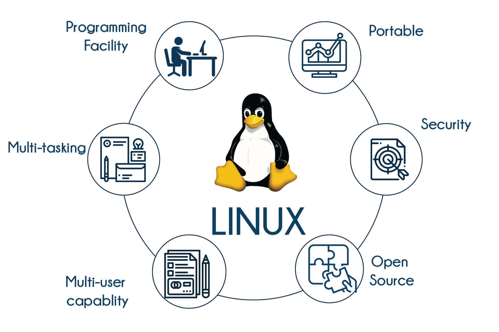

---
## Front matter
lang: ru-RU
title: Презентация на тему
subtitle: Сетевые возможности Linux
author:
  - Юсуфов Джабар Артикович
  - Кулябов Дмитрий Сергеевич (д.ф.-м.н., профессор)
institute:
  - Российский университет дружбы народов, Москва, Россия

date: 18 апреля 2025

## i18n babel
babel-lang: russian
babel-otherlangs: english

## Formatting pdf
toc: false
toc-title: Содержание
slide_level: 2
aspectratio: 169
section-titles: true
theme: metropolis
header-includes:
 - \metroset{progressbar=frametitle,sectionpage=progressbar,numbering=fraction}
---

# Информация

## Докладчик

:::::::::::::: {.columns align=center}
::: {.column width="70%"}

  * Юсуфов Джабар Артикович
  * Студент группы НКАбд-05-24
  * Российский университет дружбы народов
  * [1132246722@pfur.ru](mailto:1132246722@pfur.ru)

:::
::: {.column width="30%"}

:::
::::::::::::::

# Вводная часть

## Актуальность

- Linux - основа современной IT-инфраструктуры
- Рост спроса на сетевые технологии
- Гибкость и открытость Linux

## Цели и задачи

- Раскрыть ключевые сетевые функции Linux
- Показать преимущества Linux
- Демонстрация практической пользы

# Основная часть

## Базовые сетевые утилиты

- Ipconfig/ip-настройка интерфейсов.  

- Ping-проверка доступности.   

- Traceroute-маршрутизация  

## Базовые сетевые утилиты
 

## Сетевые сервисы (DNS и DHCP)

- DNS(bind, dnsmasq) - преобразование имен
- DHCP - автоматическая выдача IP

## Сетевые сервисы (DNS и DHCP)

## Сетевые сервисы (SSH и VPN)

- SSH: 
   - Безопасное подключение: ssh user@host
   - Ключи вместо паролей: ssh-keygen
- VPN: 
   - WireGuard: wg-quick up wg0
   - OpenVPN: конфигурация через .ovpn-файлы

## Сетевые сервисы (SSH и VPN)

## Безопасность сети

- Фаерволы:
   - iptables -A INPUT -p tcp --dport 22 -j ACCEPT
   - nftables - новая альтернатива
- Мониторинг:
   - tcpdump -i eth0 port 80

## Безопасность сети

## Веб-серверы и прокси

- Nginx:
   - Базовый конфиг: server {listen 80;} 
   - Виртальные хосты

- Apache:
   - Модульная архитектура
   - .htaccess

## Веб-серверы и прокси

## Виртуализация и контейнеры

:::::::::::::: {.columns align=center}
::: {.column width="70%"}

- Docker:
   - Сети в контейнерах
   - docker network ls
- Kubernetes:
   - Сервисы и поды
   - Ingress-контроллеры
  

:::
::: {.column width="45%"}

:::
::::::::::::::

## Облачные технологии

:::::::::::::: {.columns align=center}
::: {.column width="70%"}

- Интеграция:
   - AWS CLI
   - OpenStack
- Гибридные решения
- Локальные серверы + облако
  

:::
::: {.column width="45%"}

:::
::::::::::::::

## Будущее сетей в Linux

- Тренды:
   - Программно-конфигурируемые сети
   - 5G и edge-вычисления
- Перспективы:
   - ИИ для анализа трафика
   - Квантовые сети

# Заключение

## Выводы

:::::::::::::: {.columns align=center}
::: {.column width="70%"}

  * Linux - универсальная платформа
  * Широкие возможности кастомазации

:::
::: {.column width="45%"}

:::
::::::::::::::

    

