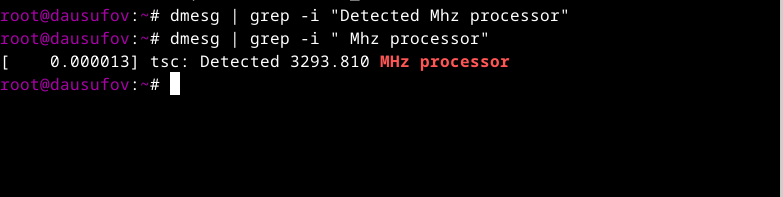

---
## Front matter
lang: ru-RU
title: Лабораторная работа №1
subtitle: Операционные системы
author:
  - Юсуфов Джабар Артикович
institute:
  - Российский университет дружбы народов, Москва, Россия
date: 7 марта 2025 года

## i18n babel
babel-lang: russian
babel-otherlangs: english

## Formatting pdf
toc: false
toc-title: Содержание
slide_level: 2
aspectratio: 169
section-titles: true
theme: metropolis
header-includes:
 - \metroset{progressbar=frametitle,sectionpage=progressbar,numbering=fraction}
---

## Цель работы

Целью данной работы является приобретение практических навыков установки операционной системы на виртуальную машину, настройки минимально необходимых для дальнейшей работы сервисов.

## Задание

1. Создание виртуальной машины
2. Установка операционной системы 
3. Работа с операционной системой после установки
4. Установка программного обеспечения для создания документации
5. Дополнительные задания

## Создание виртуальной машины

Открываю VirtualBox(рис.1).

{#fig:001 width=60%}

## Создание виртуальной машины

Создаю виртуальную машину в VirtualBox(рис.2)

{#fig:002 width=60%}

## Создание виртуальной машины

Изменяяю размер основной памяти на 4096 МБ(рис.3)

{#fig:003 width=60%}

## Создание виртуальной машины

Изменяяю размер памяти жесткого диска на 80 ГБ(рис.4)

{#fig:004 width=60%}

## Создание виртуальной машины

Конфигурация виртуальной машины(рис.5)

{#fig:005 width=60%}

## Создание виртуальной машины

Меняю видеопамять на 128 МБ(рис.6)

{#fig:006 width=60%}

## Установка операционной системы 

Запустил виртуальную машину(рис.7)

{#fig:007 width=60%}

## Установка операционной системы 

Вижу интерфейс начальной конфигурации. Нажимаю Enter для создания конфигурации(рис.8)

{#fig:008 width=60%}

## Установка операционной системы 

Запускаю Терминал нажатием клавиш Win+Enter и запускаю liveinst(рис.9)

{#fig:009 width=60%}

## Установка операционной системы 

Выбираю язык, который буду использовать в процессе установки(рис.10)

{#fig:010 width=60%}

## Установка операционной системы 

Проверяю раскладку на русском и английском языках(рис.11)

{#fig:011 width=60%}

## Установка операционной системы 

Устанавливаю дату и время(рис.12)

{#fig:012 width=60%}

## Установка операционной системы 

Выбираю место для установки(рис.13)

{#fig:013 width=60%}

## Установка операционной системы 

Устанавливаю имя узла(рис.14)

{#fig:014 width=60%}

## Установка операционной системы 

Создаю аккаунт администратора и создаю пароль для супер-пользователя(рис.15)

{#fig:015 width=60%}

## Установка операционной системы 

Создаю пользователя, добавляю административные привелегии для этой учетной записи, чтобы я мог свободно выполнять команды как супер-пользователь(рис.16)

{#fig:016 width=60%}

## Установка операционной системы 

Установил операционную систему(рис.17)

{#fig:017 width=60%}

## Работа с операционной системой после установки

В терминале устанавливаю программы дя удобства работы в консоли: tmux для открытия нескольких "вкладок" в одном терминале, mc в качестве файлового менеджера в терминале(рис.18)

{#fig:018 width=60%}

## Работа с операционной системой после установки

Перемещаюсь в директорию /etc/selinux, открываю md, ищу нужный файл(рис.19)

{#fig:019 width=60%}

## Работа с операционной системой после установки

Изменяю открытый файл: SELINUX=enforcing меняю на значение SELINUX=permissive(рис.20)

{#fig:020 width=60%}

## Работа с операционной системой после установки

Устанавливаю dkms(рис.21)

{#fig:021 width=60%}

## Работа с операционной системой после установки

Подмантировал и запустил media(рис.22)

{#fig:022 width=60%}

## Установка программного обеспечения для создания документации

Устанавливаю pandoc(рис.23)

{#fig:023 width=60%}

## Установка программного обеспечения для создания документации

Устанавливаю texlive, но не полностью(рис.24)

{#fig:024 width=60%}

## Установка программного обеспечения для создания документации

Установил texlive до конца(рис.25)

{#fig:025 width=60%}

## Дополнительные задания

Узнаю версию ядра Linux(рис.26)

{#fig:026 width=60%}

## Дополнительные задания

Узнаю частоту процессора(рис.27)

{#fig:027 width=60%}

## Дополнительные задания

Узнаю модель процессора(рис.28)

{#fig:028 width=60%}

## Дополнительные задания

Узнаю объем доступной оперативной памяти(рис.29)

{#fig:029 width=60%}

## Дополнительные задания

Узнаю тип обнаруженного гипервизора(рис.30)

{#fig:030 width=60%}

## Дополнительные задания

Узнаю тип файловой системы корневого раздела(рис.31)

{#fig:031 width=60%}

## Дополнительные задания

Узнаю последовательность монтирования файловых систем(рис.32)

{#fig:032 width=60%}

## Выводы

В ходе данной лабораторной работы я приобрел практические навыки установки операционной систсемы, а также настройки необходимых для дальнейшей работы сервисов

## Список литературы

::: {#refs}
1. Dash, P. Getting Started with Oracle VM VirtualBox / P. Dash. – Packt Publishing Ltd, 2013. – 86 сс.
2. Colvin, H. VirtualBox: An Ultimate Guide Book on Virtualization with VirtualBox. VirtualBox / H. Colvin. – CreateSpace Independent Publishing Platform, 2015. – 70 сс.
3. Vugt, S. van. Red Hat RHCSA/RHCE 7 cert guide : Red Hat Enterprise Linux 7 (EX200 and EX300) : Certification Guide. Red Hat RHCSA/RHCE 7 cert guide / S. van Vugt. – Pearson IT Certification, 2016. – 1008 сс.
4. Робачевский, А. Операционная система UNIX / А. Робачевский, С. Немнюгин, О. Стесик. – 2-е изд. – Санкт-Петербург : БХВ-Петербург, 2010. – 656 сс.
5. Немет, Э. Unix и Linux: руководство системного администратора. Unix и Linux / Э. Немет, Г. Снайдер, Т.Р. Хейн, Б. Уэйли. – 4-е изд. – Вильямс, 2014. – 1312 сс.
6. Колисниченко, Д.Н. Самоучитель системного администратора Linux : Системный администратор / Д.Н. Колисниченко. – Санкт-Петербург : БХВ-Петербург, 2011. – 544 сс.
7. Robbins, A. Bash Pocket Reference / A. Robbins. – O’Reilly Media, 2016. – 156 сс.
:::

