---
## Front matter
lang: ru-RU
title: Лабораторная работа №2
subtitle: Операционные системы
author:
  - Юсуфов Джабар Артикович
institute:
  - Российский университет дружбы народов, Москва, Россия
date: 8 марта 2025 года

## i18n babel
babel-lang: russian
babel-otherlangs: english

## Formatting pdf
toc: false
toc-title: Содержание
slide_level: 2
aspectratio: 169
section-titles: true
theme: metropolis
header-includes:
 - \metroset{progressbar=frametitle,sectionpage=progressbar,numbering=fraction}
---

## Цель работы 

Изучить идеологию и применение средств контроля версий.
Освоить умения по работе с git.

## Задание

1. Создать базовую конфигурацию для работы с git
2. Создать ключ SSH
3. Создать ключ PGP
4. Настроить подписи git
5. Зарегистрироваться на Github
6. Создать локальный каталог для выполнения заданий по предмету

## Установка программного обеспечения

Устанавливаю git (рис.1)

{#fig:001 width=60%}

## Установка программного обеспечения

Установка gh (рис.2)

{#fig:002 width=60%}

## Базовая настройка git 

Задаю имя и email владельца репозитория (рис.3)

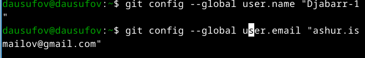{#fig:003 width=60%}

## Базовая настройка git 

Настраиваю utf-8 в выводе сообщений git (рис.4)

{#fig:004 width=60%}

## Базовая настройка git 

Задаю имя начальной ветки (рис.5)

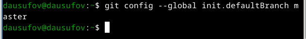{#fig:005 width=60%}

## Базовая настройка git 

Параметр autocrlf (рис.6)

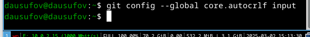{#fig:006 width=60%}

## Базовая настройка git 

Парамметр safecrlf (рис.7)

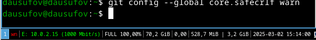{#fig:007 width=60%}

## Создание ключей ssh

Создаю ключ по алгоритму rsa с ключем размером 4096 бит (рис.8)

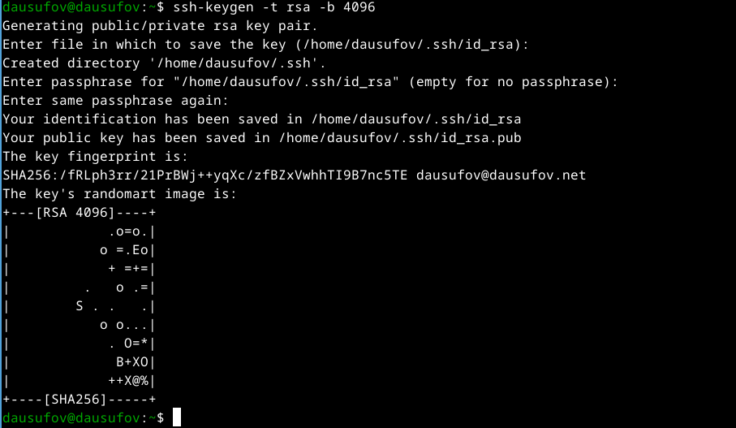{#fig:008 width=60%}

## Создание ключей ssh

Создаю ключ по алгоритму ed25519 (рис.9)

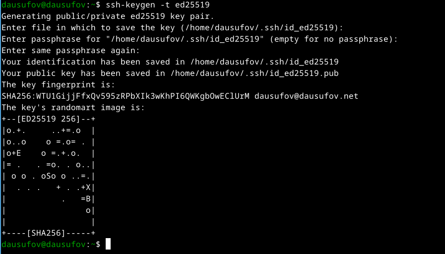{#fig:009 width=60%}

## Создание ключей pgp

Генерирую ключ (рис.10)

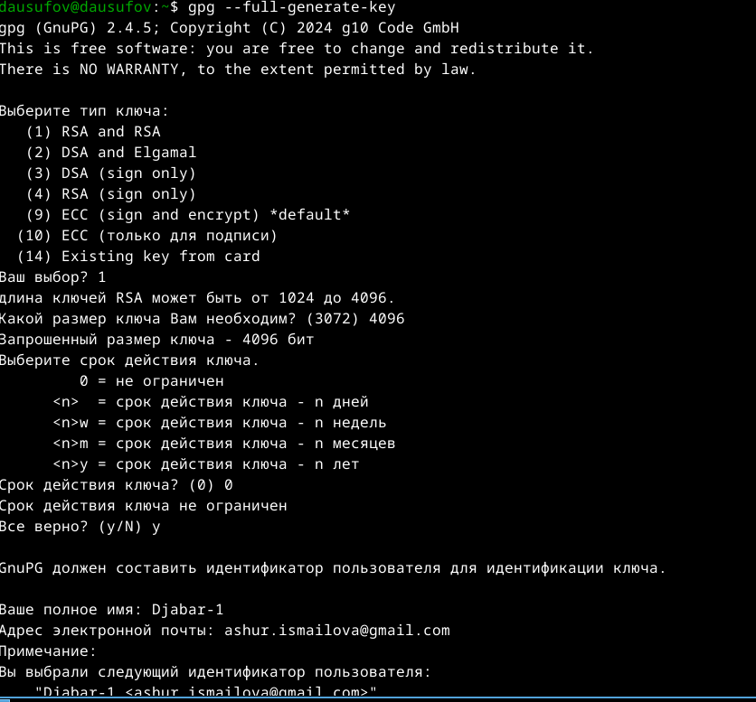{#fig:010 width=60%}

## Создание ключей pgp

Личная информация, которая хранится в ключе (рис.11)

{#fig:011 width=60%}

## Регистрация на Github

Моя учетная запись на Github, которая осталась с прошлого курса (рис.12)

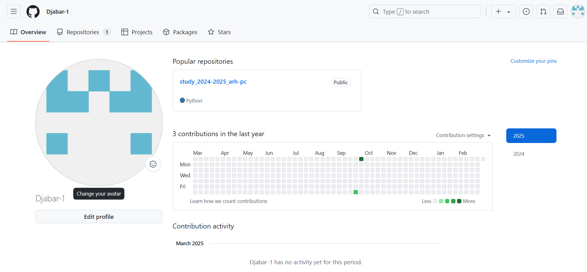{#fig:012 width=60%}

## Регистрация на Github

Вывожу список ключей и копирую отпечаток приватного ключа (рис.13)

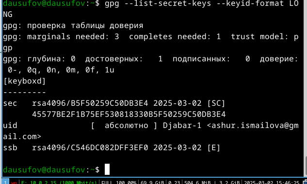{#fig:013 width=60%}

## Регистрация на Github

Добавляю новый GPG ключ на Github (рис.14)

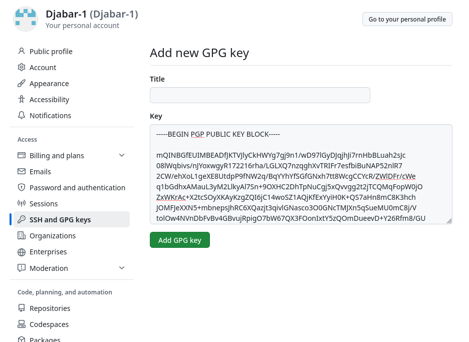{#fig:014 width=60%}

## Регистрация на Github

Скопировал сгенерированный ключ в буфер отмена (рис.15)

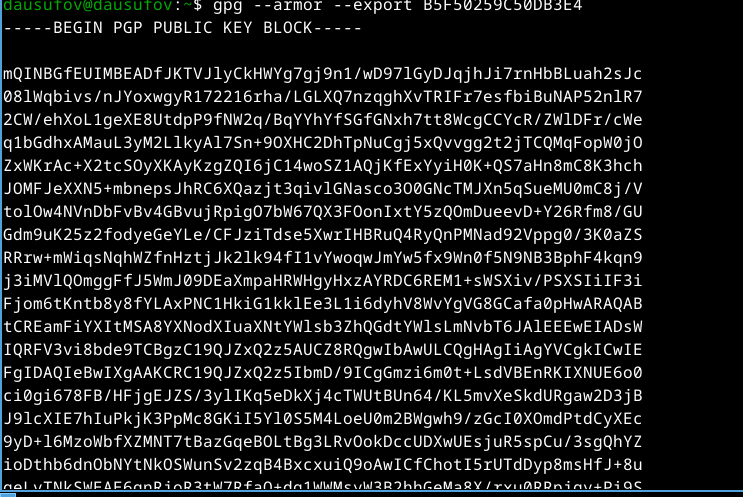{#fig:015 width=60%}

## Регистрация на Github

Добавил ключ gpg на Github (рис.16)

{#fig:016 width=60%}

## Настройка автоматических подписей коммитов git

Используя введенный email, указываю Git применять его при подписи коммитов (рис.17. рис.18, рис. 19)

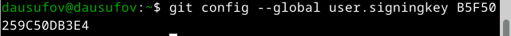{#fig:017 width=60%}

## Настройка автоматических подписей коммитов git

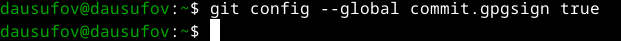{#fig:018 width=60%}

## Настройка автоматических подписей коммитов git

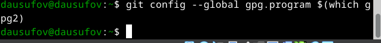{#fig:019 width=60%}

## Настройка gh

Начинаю авторизовываться через gh и отвечаю на наводящие вопросы (рис.20)

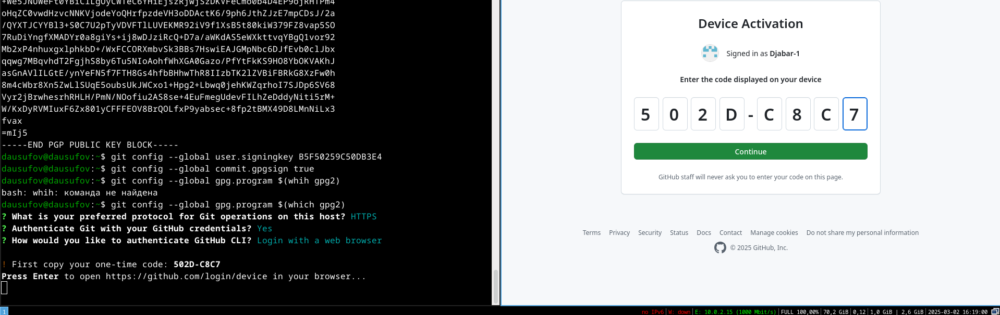{#fig:020 width=60%}

## Настройка gh

Успешно все сделал (рис.21)

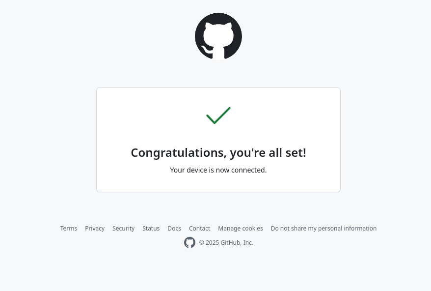{#fig:021 width=60%}

## Настройка gh

Вижу сообщении о завершении авторизации (рис.22)

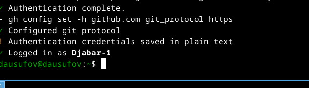{#fig:022 width=60%}

## Создание репозитория курса на основе шаблона

Создаю репозиторий (рис.23)

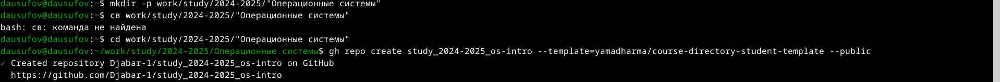{#fig:023 width=60%}

## Создание репозитория курса на основе шаблона

Клонирую репозиторий к себе в директорию (рис.24)

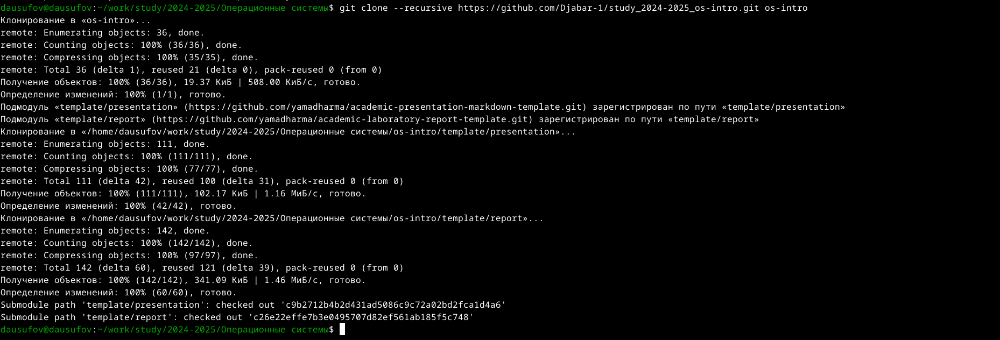{#fig:024 width=60%}

## Создание репозитория курса на основе шаблона

Переходу в директрию os-intro (рис.25)

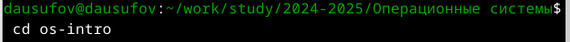{#fig:025 width=60%}

## Создание репозитория курса на основе шаблона

Удаляю лишние файлы (рис.26)

{#fig:026 width=60%}

## Создание репозитория курса на основе шаблона

Создаю необходимые каталоги (рис.27)

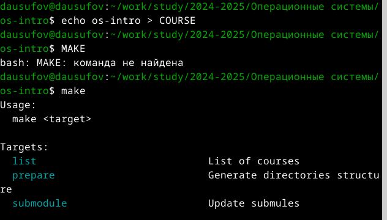{#fig:027 width=60%}

## Создание репозитория курса на основе шаблона

Отправляю файлы на сервер (рис.28) 

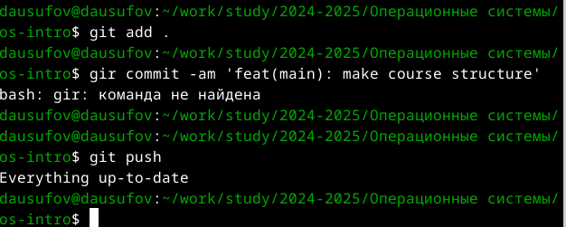{#fig:028 width=60%}

## Выводы

В ходе этой работы я изучил идеологию и применение средств контроля версий и освоил умения по работе с git
