---
## Front matter
title: "Выполнение лабораторной работы №2"
subtitle: "Операционные системы"
author: "Юсуфов Джабар Артикович"

## Generic otions
lang: ru-RU
toc-title: "Содержание"

## Bibliography
bibliography: bib/cite.bib
csl: pandoc/csl/gost-r-7-0-5-2008-numeric.csl

## Pdf output format
toc: true # Table of contents
toc-depth: 2
lof: true # List of figures
lot: true # List of tables
fontsize: 12pt
linestretch: 1.5
papersize: a4
documentclass: scrreprt
## I18n polyglossia
polyglossia-lang:
  name: russian
  options:
	- spelling=modern
	- babelshorthands=true
polyglossia-otherlangs:
  name: english
## I18n babel
babel-lang: russian
babel-otherlangs: english
## Fonts
mainfont: IBM Plex Serif
romanfont: IBM Plex Serif
sansfont: IBM Plex Sans
monofont: IBM Plex Mono
mathfont: STIX Two Math
mainfontoptions: Ligatures=Common,Ligatures=TeX,Scale=0.94
romanfontoptions: Ligatures=Common,Ligatures=TeX,Scale=0.94
sansfontoptions: Ligatures=Common,Ligatures=TeX,Scale=MatchLowercase,Scale=0.94
monofontoptions: Scale=MatchLowercase,Scale=0.94,FakeStretch=0.9
mathfontoptions:
## Biblatex
biblatex: true
biblio-style: "gost-numeric"
biblatexoptions:
  - parentracker=true
  - backend=biber
  - hyperref=auto
  - language=auto
  - autolang=other*
  - citestyle=gost-numeric
## Pandoc-crossref LaTeX customization
figureTitle: "Рис."
tableTitle: "Таблица"
listingTitle: "Листинг"
lofTitle: "Список иллюстраций"
lotTitle: "Список таблиц"
lolTitle: "Листинги"
## Misc options
indent: true
header-includes:
  - \usepackage{indentfirst}
  - \usepackage{float} # keep figures where there are in the text
  - \floatplacement{figure}{H} # keep figures where there are in the text
---

# Цель работы

Изучить идеологию и применение средств контроля версий.
Освоить умения по работе с git.

# Задание

1. Создать базовую конфигурацию для работы с git
2. Создать ключ SSH
3. Создать ключ PGP
4. Настроить подписи git
5. Зарегистрироваться на Github
6. Создать локальный каталог для выполнения заданий по предмету

# Выполнение лабораторной работы

## Установка программного обеспечения 

Устанавливаю git (рис.1)

{#fig:001 width=70%}

Установка gh (рис.2)

{#fig:002 width=70%}

## Базовая настройка git

Задаю имя и email владельца репозитория (рис.3)

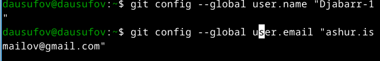{#fig:003 width=70%}

Настраиваю utf-8 в выводе сообщений git (рис.4)

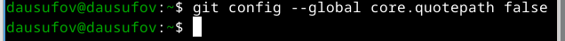{#fig:004 width=70%}

Задаю имя начальной ветки (рис.5)

{#fig:005 width=70%}

Параметр autocrlf (рис.6)

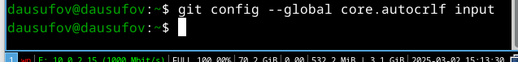{#fig:006 width=70%}

Парамметр safecrlf (рис.7)

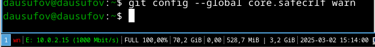{#fig:007 width=70%}

## Создание ключей ssh

Создаю ключ по алгоритму rsa с ключем размером 4096 бит (рис.8)

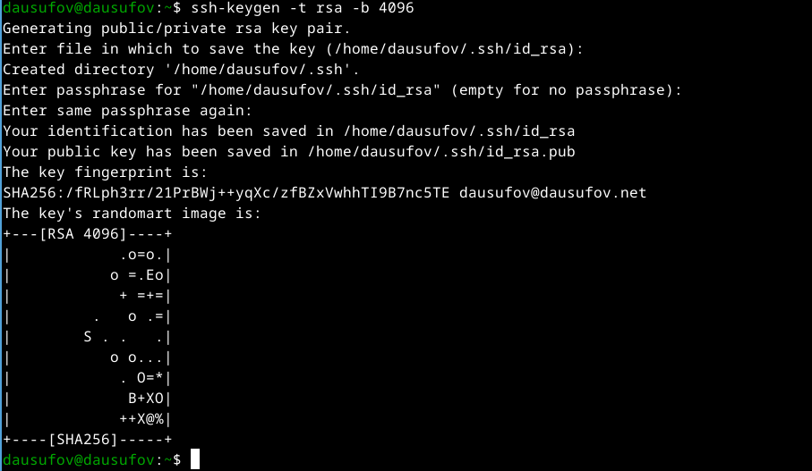{#fig:008 width=70%}

Создаю ключ по алгоритму ed25519 (рис.9)

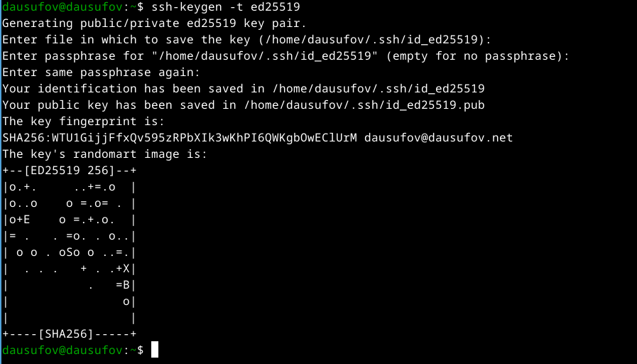{#fig:008 width=70%}

## Создание ключей pgp

Генерирую ключ (рис.10)

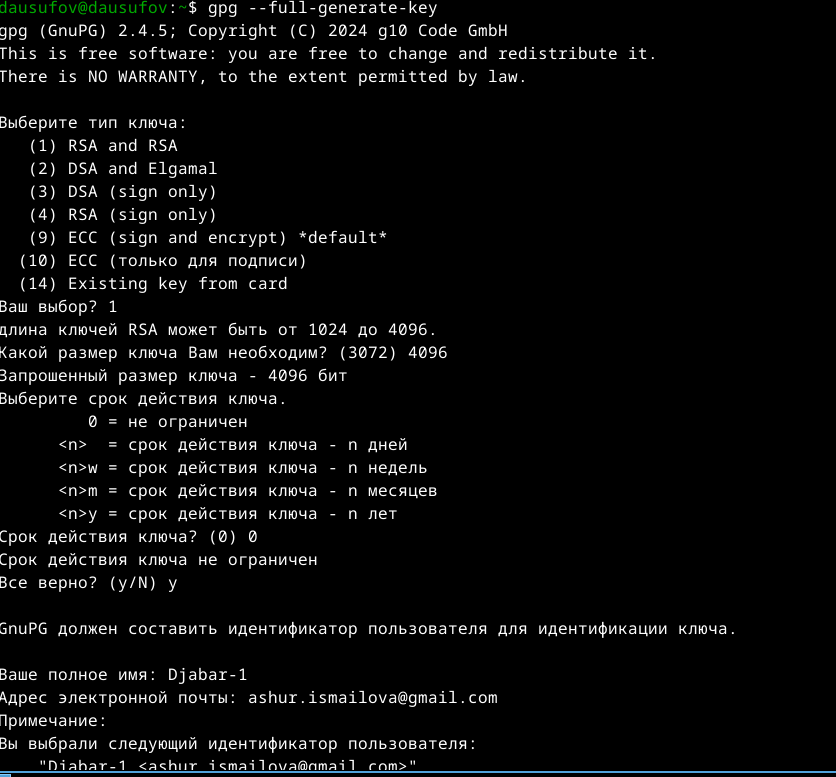{#fig:010 width=70%}

Личная информация, которая хранится в ключе (рис.11)

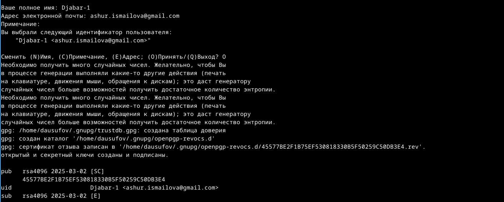{#fig:011 width=70%}

## Регистрация на Github

Моя учетная запись на Github, которая осталась с прошлого курса (рис.12)

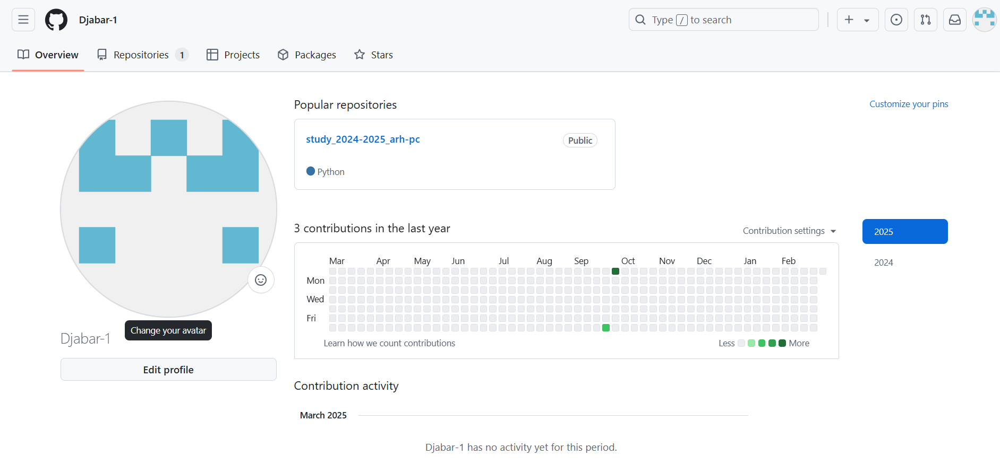{#fig:012 width=70%}

Вывожу список ключей и копирую отпечаток приватного ключа (рис.13)

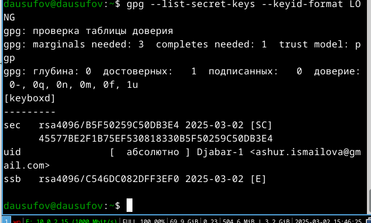{#fig:013 width=70%}

Добавляю новый GPG ключ на Github (рис.14)

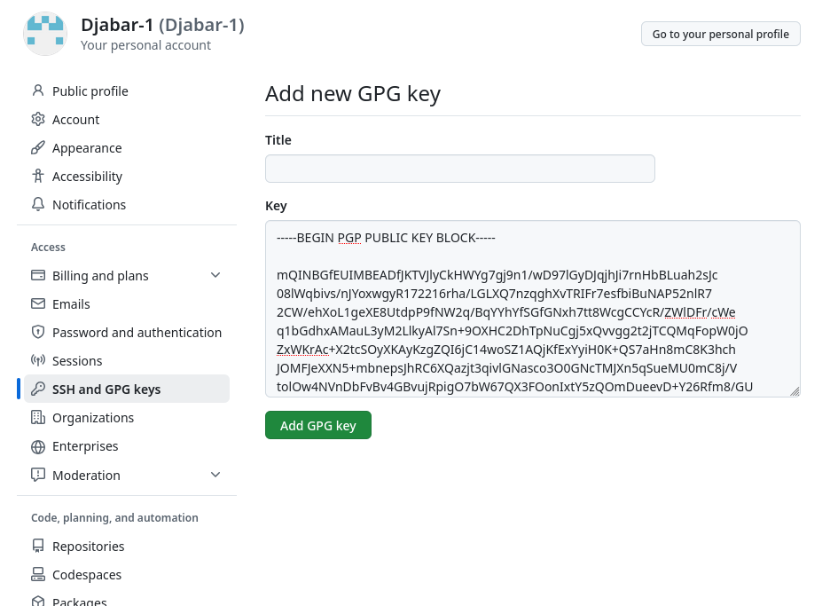{#fig:014 width=70%}

Скопировал сгенерированный ключ в буфер отмена (рис.15)

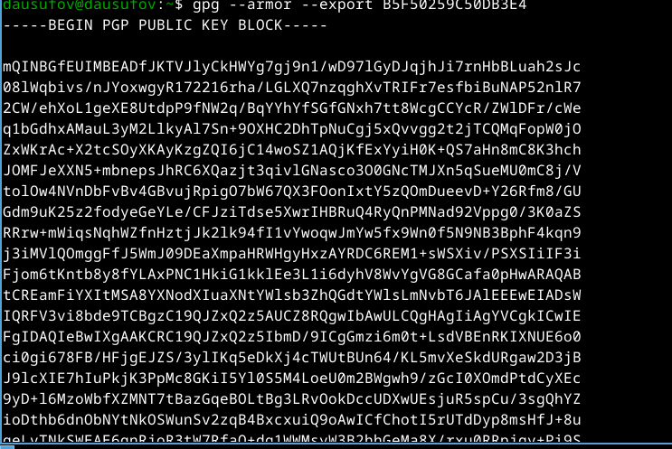{#fig:015 width=70%}

Добавил ключ gpg на Github (рис.16)

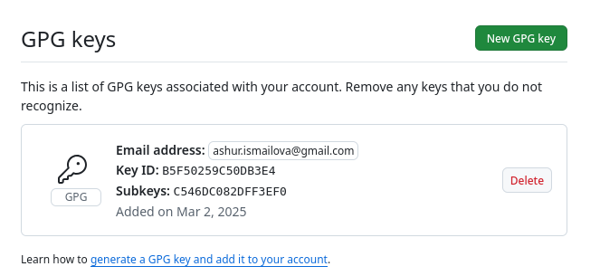{#fig:016 width=70%}

## Настройка автоматических подписей коммитов git

Используя введенный email, указываю Git применять его при подписи коммитов (рис.17. рис.18, рис. 19)

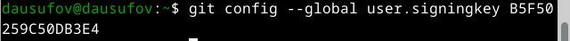{#fig:017 width=70%}

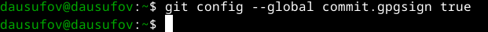{#fig:018 width=70%}

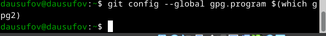{#fig:019 width=70%}

## Настройка gh

Начинаю авторизовываться через gh и отвечаю на наводящие вопросы (рис.20)

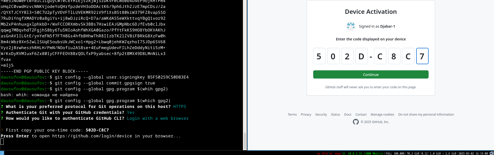{#fig:020 width=70%}

Успешно все сделал (рис.21)

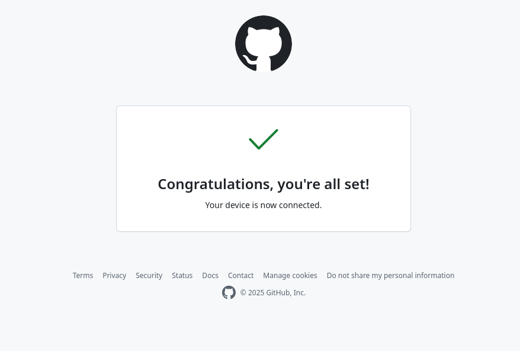{#fig:021 width=70%}

Вижу сообщении о завершении авторизации (рис.22)

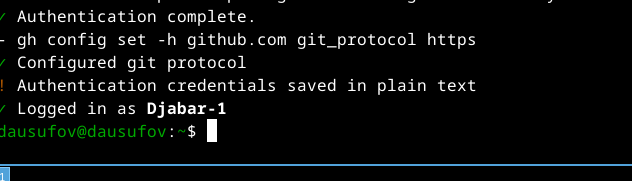{#fig:022 width=70%}

## Создание репозитория курса на основе шаблона

Создаю репозиторий (рис.23)

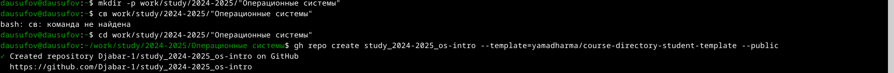{#fig:023 width=70%}

Клонирую репозиторий к себе в директорию (рис.24)

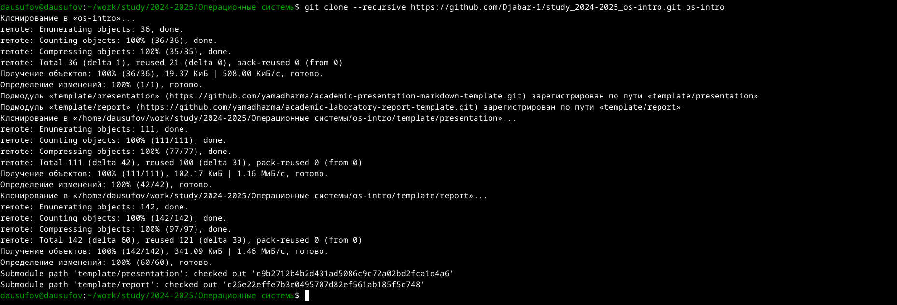{#fig:024 width=70%}

Переходу в директрию os-intro (рис.25)
 
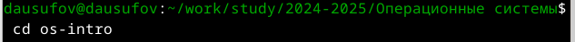{#fig:025 width=70%}

Удаляю лишние файлы (рис.26)

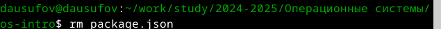{#fig:026 width=70%}

Создаю необходимые каталоги (рис.27)

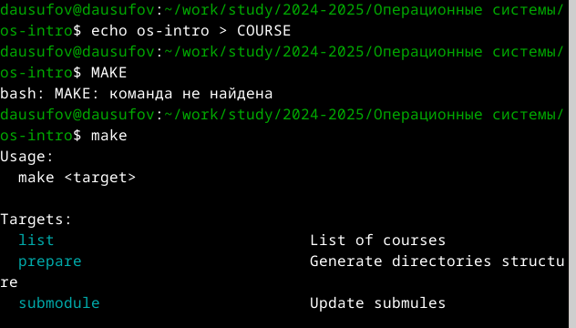{#fig:027 width=70%}

Отправляю файлы на сервер (рис.28) 

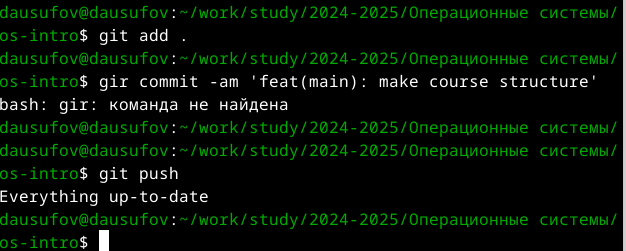{#fig:028 width=70%}

# Выводы

В ходе этой работы я изучил идеологию и применение средств контроля версий и освоил умения по работе с git

