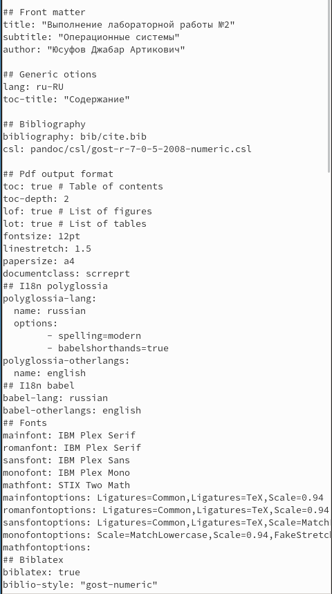
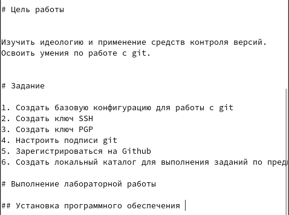
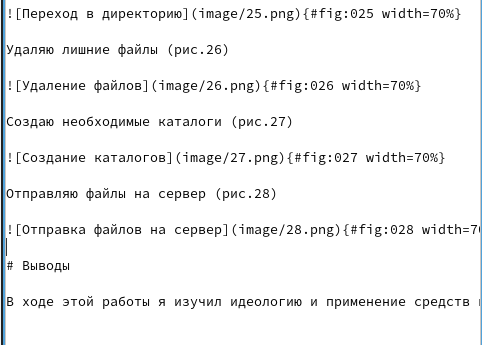
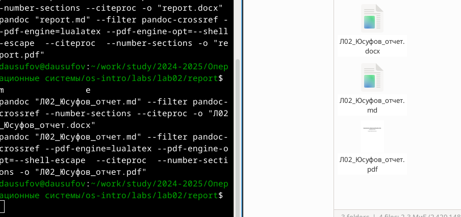
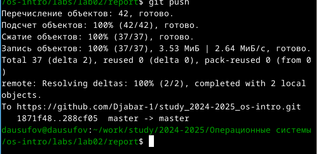

---
## Front matter
lang: ru-RU
title: Лабораторная работа №3
subtitle: Операционные системы
author:
  - Юсуфов Джабар Артикович
institute:
  - Российский университет дружбы народов, Москва, Россия
date: 8 марта 2025 года

## i18n babel
babel-lang: russian
babel-otherlangs: english

## Formatting pdf
toc: false
toc-title: Содержание
slide_level: 2
aspectratio: 169
section-titles: true
theme: metropolis
header-includes:
 - \metroset{progressbar=frametitle,sectionpage=progressbar,numbering=fraction}
---

## Цель работы

Научиться оформлять отчеты с помощью легковесного языка разметки Markdown.

## Задание

1. Сделать отчет по предыдущей лабораторной работе в формате Markdown
2. Предоставить отчеты в 3 форматах

## Создание отчета по предыдущей лабораторной работе

Открыл файл report.md и начал его заполнять (рис.1)

{#fig:001 width=60%}

## Создание отчета по предыдущей лабораторной работе

Оформляю отчет (рис.2)

{#fig:002 width=60%}

## Создание отчета по предыдущей лабораторной работе

Завершил оформлять отчет (рис.3)

{#fig:003 width=60%}

## Предоставление отчетов в 3 форматах

Переименовал файл report.md и прописал команду make в терминале. Получил 3 разных формата файла (рис.4)

{#fig:004 width=60%}

## Предоставление отчетов в 3 форматах

Отправляю все на Github (рис.5)

{#fig:005 width=60%}

## Выводы

В ходе данной работы я научился оформлять отчеты с помощью легковесного языка разметки Markdown.