---
## Front matter
lang: ru-RU
title: Лабораторная работа №4
subtitle: Операционные системы
author:
  - Юсуфов Джабар Артикович
institute:
  - Российский университет дружбы народов, Москва, Росси
date: 08 марта 2025

## i18n babel
babel-lang: russian
babel-otherlangs: english

## Formatting pdf
toc: false
toc-title: Содержание
slide_level: 2
aspectratio: 169
section-titles: true
theme: metropolis
header-includes:
 - \metroset{progressbar=frametitle,sectionpage=progressbar,numbering=fraction}
---

## Цель работы

1. Выполнить работу для тестового репозитория.
2. Преобразовать рабочий репозиторий в репозиторий с git-flow и conventional commits.

## Установка Node.js

Устанавливаю Node.js и pnpm (рис.1)

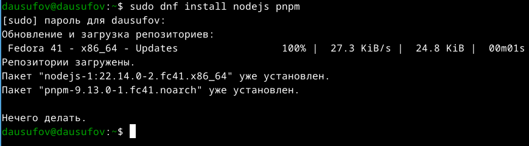{#fig:001 width=60%}

## Установка Node.js

Устанавливаю git-flow (рис.2)

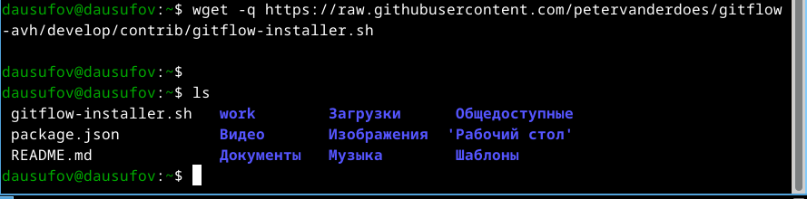{#fig:002 width=60%}

## Установка Node.js

Выполняю скрипт от имени супер-пользователя (рис.3)

{#fig:003 width=60%}

## Установка Node.js

Удаляю установщик (Рис. 4)

{#fig:004 width=60%}

## Настройка Node.js

Запускаю pnpm (рис.5)

{#fig:005 width=60%}

## Настройка Node.js

Перелогинился (рис.6)

{#fig:006 width=60%}

## Общепринятые коммиты

Устанавливаю скрипт git-cz

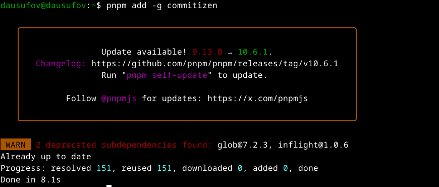{#fig:007 width=60%}

## Общепринятые коммиты

Программа для помощи в создании логов (рис.8)

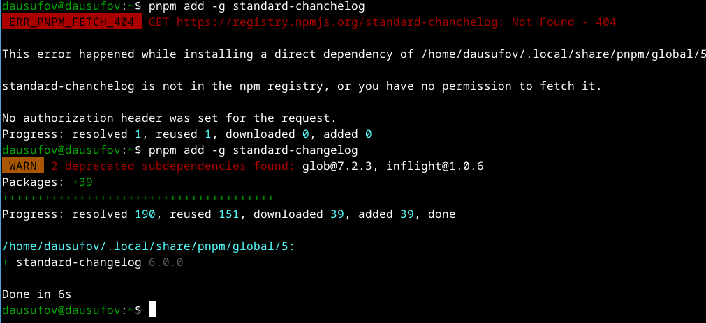{#fig:008 width=60%}

## Создание репозитория git

Создаю публичный репозиторий (рис.9)

{#fig:009 width=70%}

## Создание репозитория git

Клонирую пустой репозиторий (рис.10)

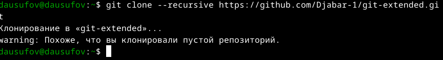{#fig:010 width=70%}

## Создание репозитория git

Конфигурирую общепринятые коммиты (рис.11)

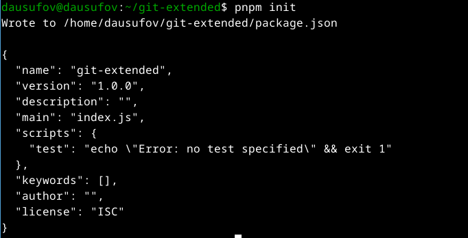{#fig:011 width=70%}

## Создание репозитория git

Изменяю файл package.json (рис.12)

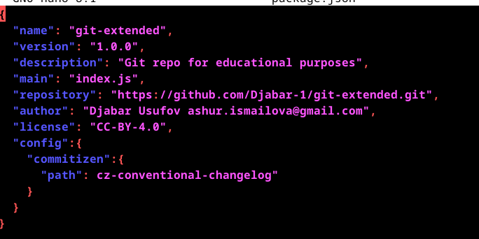{#fig:012 width=70%}

## Создание репозитория git

Добавляю новые файлы, выполняю коммит и отправляю на github (рис.13)

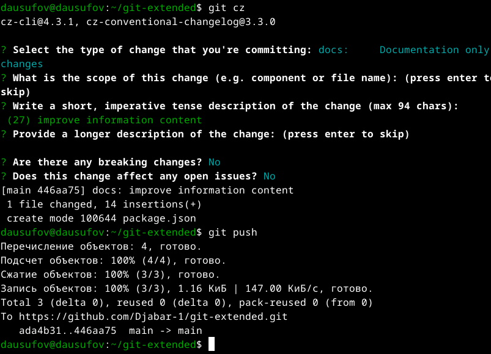{#fig:013 width=70%}

## Создание репозитория git

Инициализирую git-flow (рис.14)

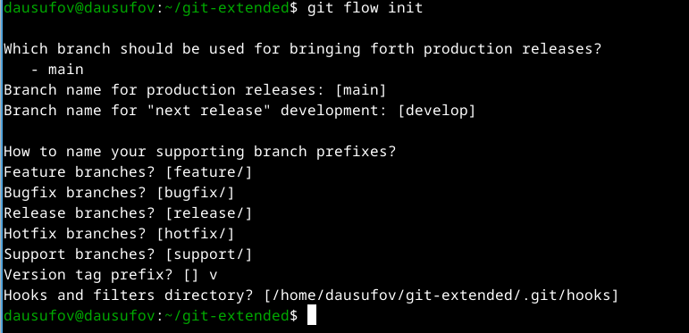{#fig:014 width=70%}

## Создание репозитория git

Загружаю репозиторий в хранилище (рис.15)

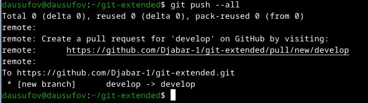{#fig:015 width=70%}

## Создание репозитория git

Устанавливаю внешнюю ветку и создаю релиз версии 1.0.0 (рис.16)

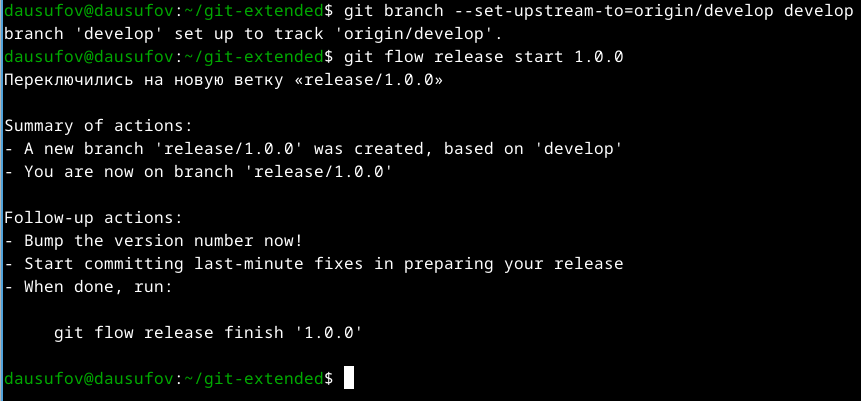{#fig:016 width=70%}

## Создание репозитория git

Создаю журнал изменений и выполняю коммит (рис.17)

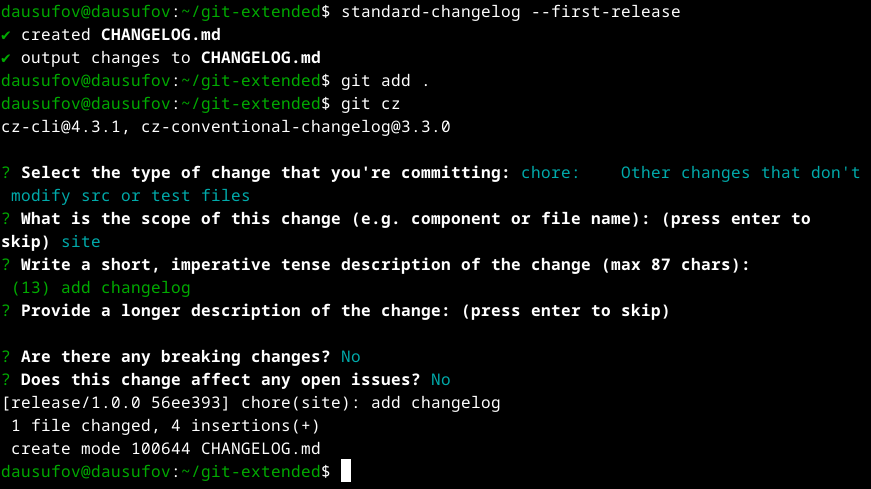{#fig:017 width=70%}

## Создание репозитория git

Зальем релизную ветку в основную ветку (рис.18)

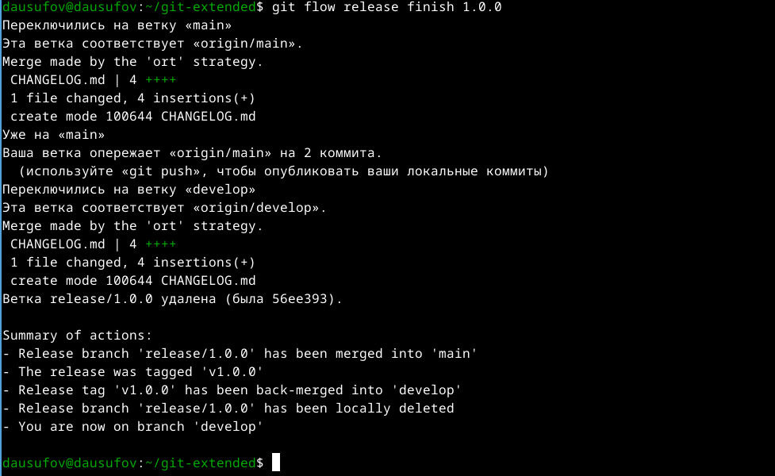{#fig:018 width=70%}

## Создание репозитория git

Отправляю данные на github и создаю релиз (рис.19)

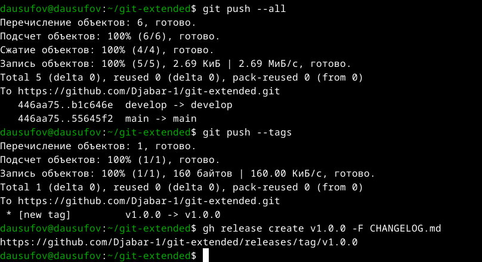{#fig:019 width=70%}

## Работа с репозиторием git

Создаю ветку для новой функциональности (рис.20)

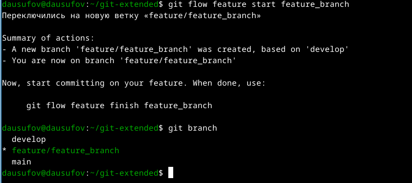{#fig:020 width=70%}

## Работа с репозиторием git

Создаю релиз с версией 1.2.3 (рис.21)

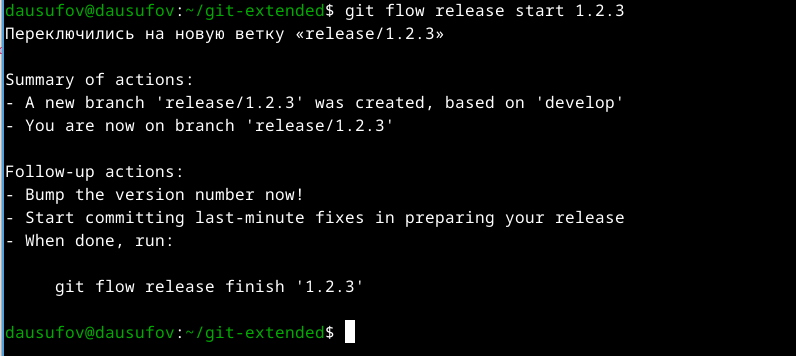{#fig:021 width=70%}

## Работа с репозиторием git

Внутри файла меняю версию (рис.22)

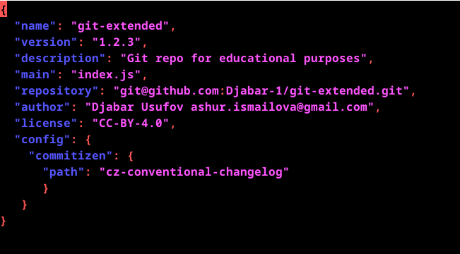{#fig:022 width=70%}

## Работа с репозиторием git

Добавляю журнал изменений в индекс (рис.23) 

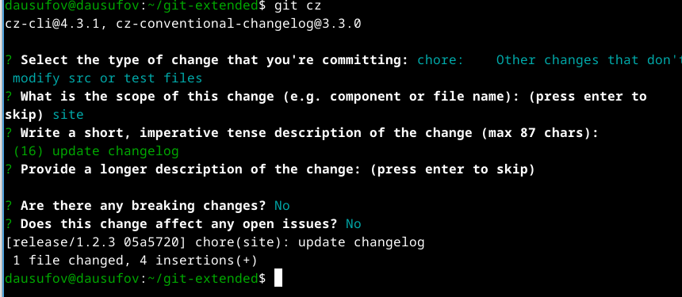{#fig:023 width=70%}

## Работа с репозиторием git

Зальем релизную ветку в основную ветку (рис.24)

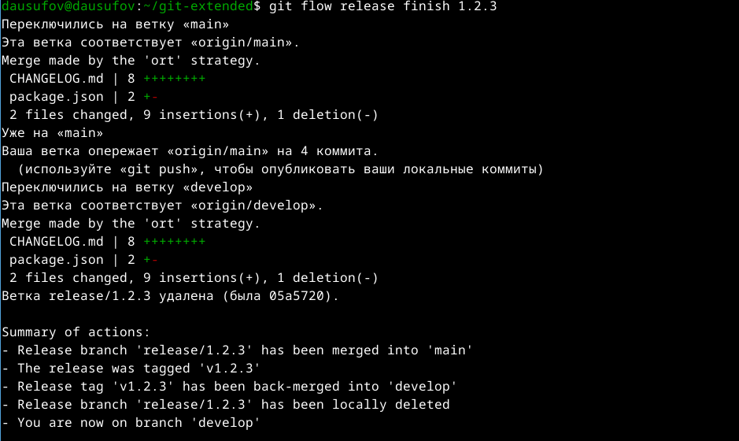{#fig:024 width=70%}

## Работа с репозиторием git

Отправляю данные на github и создаю релиз на github (рис.25)

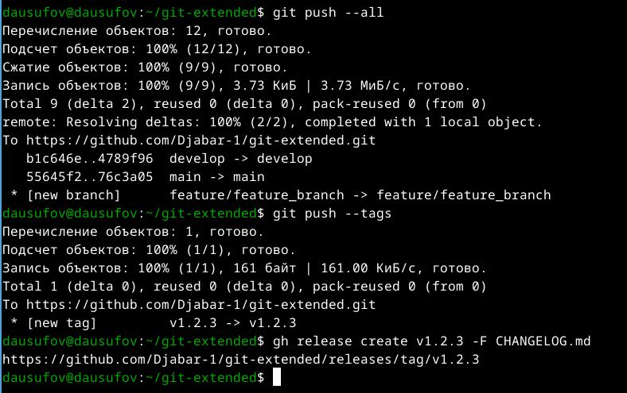{#fig:025 width=70%}

## Выводы

В ходе данной работы я научился создавать релиз.

