---
## Front matter
title: "Лабораторная работа №4"
subtitle: "Операционные системы"
author: "Юсуфов Джабар Артикович"

## Generic otions
lang: ru-RU
toc-title: "Содержание"

## Bibliography
bibliography: bib/cite.bib
csl: pandoc/csl/gost-r-7-0-5-2008-numeric.csl

## Pdf output format
toc: true # Table of contents
toc-depth: 2
lof: true # List of figures
lot: true # List of tables
fontsize: 12pt
linestretch: 1.5
papersize: a4
documentclass: scrreprt
## I18n polyglossia
polyglossia-lang:
  name: russian
  options:
	- spelling=modern
	- babelshorthands=true
polyglossia-otherlangs:
  name: english
## I18n babel
babel-lang: russian
babel-otherlangs: english
## Fonts
mainfont: IBM Plex Serif
romanfont: IBM Plex Serif
sansfont: IBM Plex Sans
monofont: IBM Plex Mono
mathfont: STIX Two Math
mainfontoptions: Ligatures=Common,Ligatures=TeX,Scale=0.94
romanfontoptions: Ligatures=Common,Ligatures=TeX,Scale=0.94
sansfontoptions: Ligatures=Common,Ligatures=TeX,Scale=MatchLowercase,Scale=0.94
monofontoptions: Scale=MatchLowercase,Scale=0.94,FakeStretch=0.9
mathfontoptions:
## Biblatex
biblatex: true
biblio-style: "gost-numeric"
biblatexoptions:
  - parentracker=true
  - backend=biber
  - hyperref=auto
  - language=auto
  - autolang=other*
  - citestyle=gost-numeric
## Pandoc-crossref LaTeX customization
figureTitle: "Рис."
tableTitle: "Таблица"
listingTitle: "Листинг"
lofTitle: "Список иллюстраций"
lotTitle: "Список таблиц"
lolTitle: "Листинги"
## Misc options
indent: true
header-includes:
  - \usepackage{indentfirst}
  - \usepackage{float} # keep figures where there are in the text
  - \floatplacement{figure}{H} # keep figures where there are in the text
---

# Цель работы

Получение навыков правильной работы с репозиториями git.

# Задание

1. Выполнить работу для тестового репозитория.
2. Преобразовать рабочий репозиторий в репозиторий с git-flow и conventional commits.

# Выполнение лабораторной работы

## Установка Node.js

Устанавливаю Node.js и pnpm (рис.1)

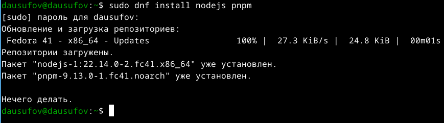{#fig:001 width=70%}

Устанавливаю git-flow (рис.2)

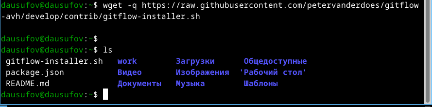{#fig:002 width=70%}

Выполняяю скрипт от имени супер-пользователя (рис.3)

{#fig:003 width=70%}

Удаляю установщик (Рис. 4)

{#fig:004 width=70%}

## Настройка Node.js

Запускаю pnpm (рис.5)

{#fig:005 width=70%}

Перелогинился (рис.6)

{#fig:006 width=70%}

## Общепринятые коммиты

Устанавливаю скрипт git-cz

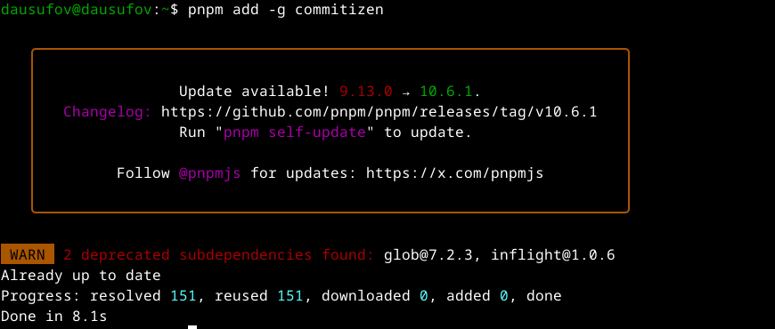{#fig:007 width=70%}

Программа для помощи в создании логов (рис.8)

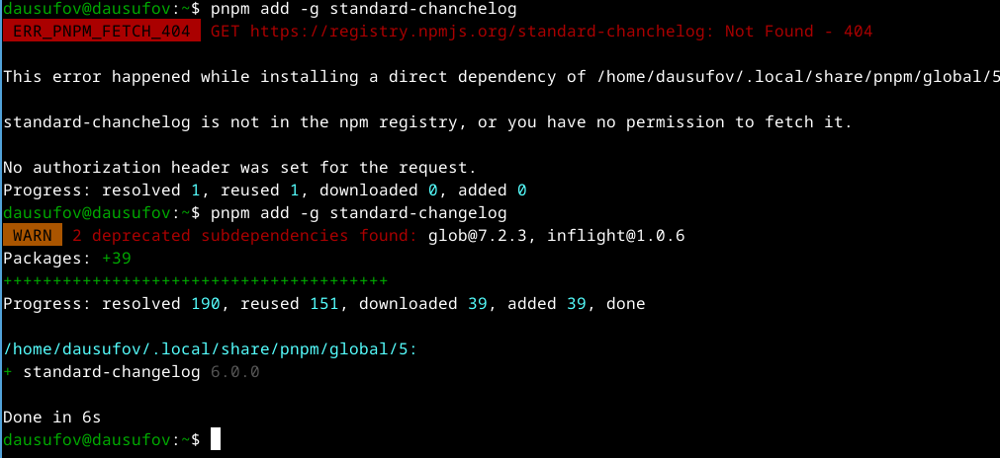{#fig:008 width=70%}

## Создание репозитория git

Создаю публичный репозиторий (рис.9)

{#fig:009 width=70%}

Клонирую пустой репозиторий (рис.10)

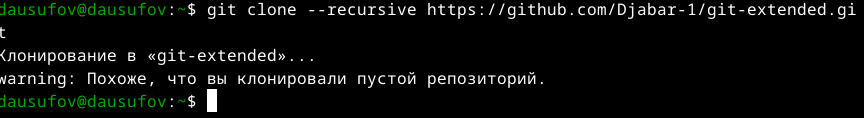{#fig:010 width=70%}

Конфигурирую общепринятых коммитов (рис.11)

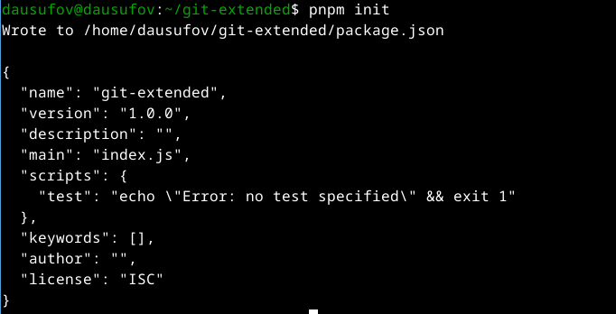{#fig:011 width=70%}

Изменяю файл package.json (рис.12)

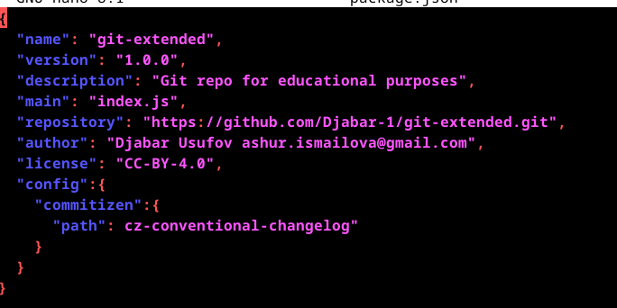{#fig:012 width=70%}

Добавляю новые файлы, выполняю коммит и отправляю на github (рис.13)

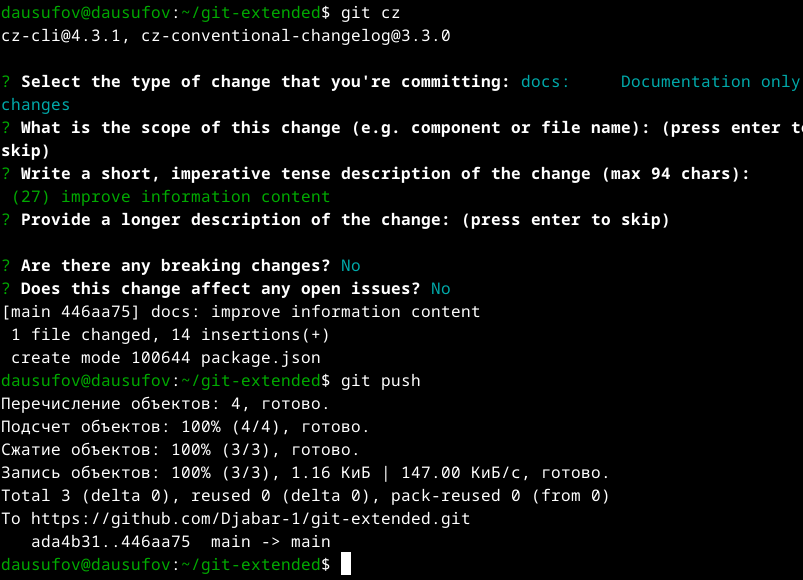{#fig:013 width=70%}

Инициализирую git-flow (рис.14)

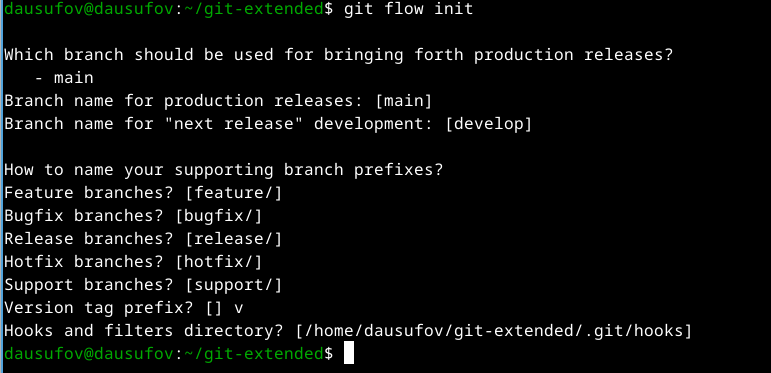{#fig:014 width=70%}

Загружаю репозиторий в хранилище (рис.15)

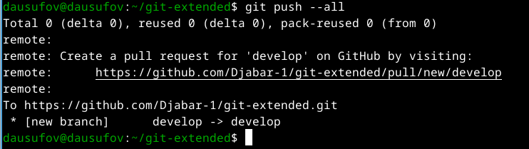{#fig:015 width=70%}

Устанавливаю внешнюю ветку и создаю релиз версии 1.0.0(рис.16)

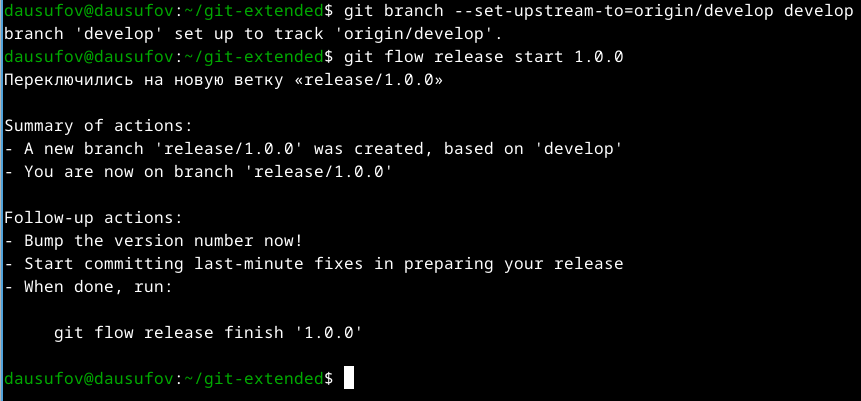{#fig:016 width=70%}

Создаю журнал изменений и выполняю коммит (рис.17)

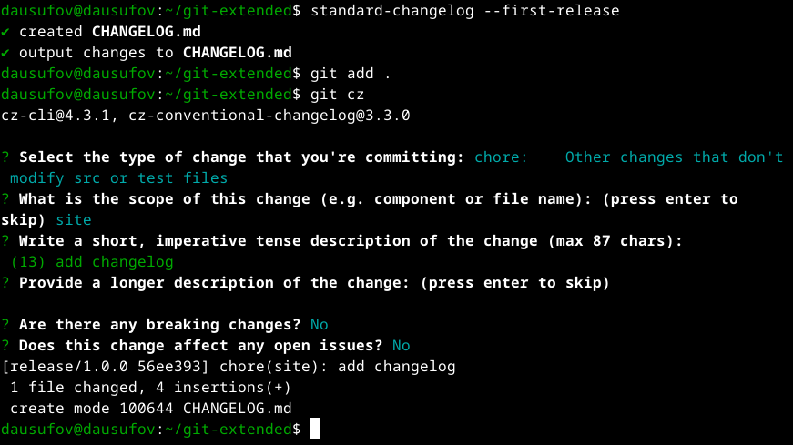{#fig:017 width=70%}

Зальем релизную ветку в основную ветку (рис.18)

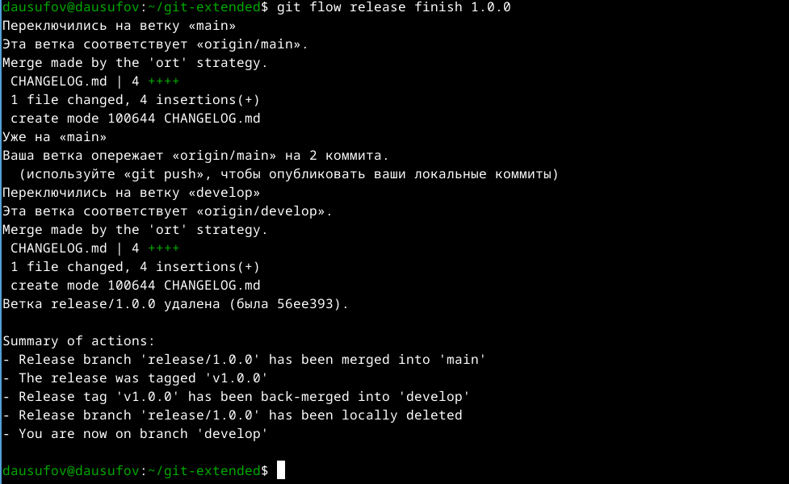{#fig:018 width=70%}

Отправляю данные на github и создаю релиз (рис.19)

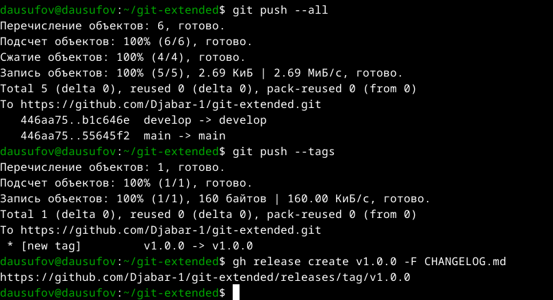{#fig:019 width=70%}

## Работа с репозиторием git

Создаю ветку для новой функциональности (рис.20)

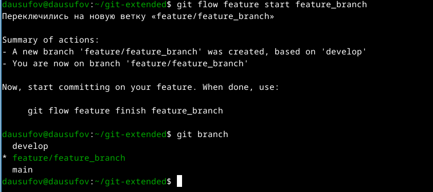{#fig:020 width=70%}

Создаю релиз с версией 1.2.3 (рис.21)

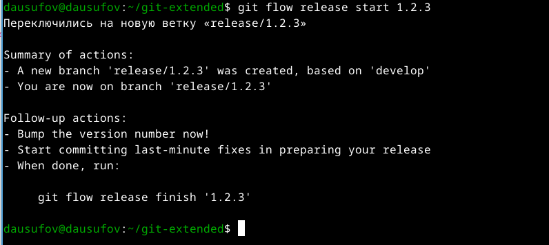{#fig:021 width=70%}

Внутри файла меняю версию (рис.22)

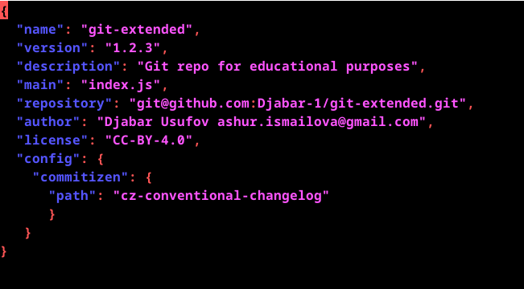{#fig:022 width=70%}

Добавляю журнал изменений в индекс (рис.23) 

{#fig:023 width=70%}

Зальем релизную ветку в основную ветку (рис.24)

{#fig:024 width=70%}

Отправляю данные на github и создаю релиз на github(рис.25)

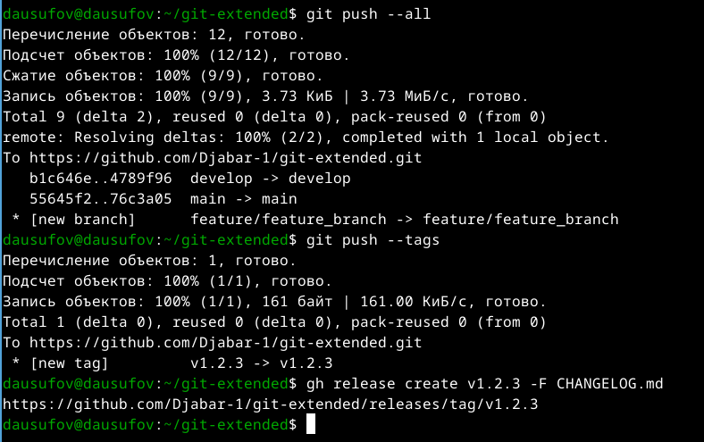{#fig:025 width=70%}

# Выводы

В ходе данной работы я научился создавать релиз

