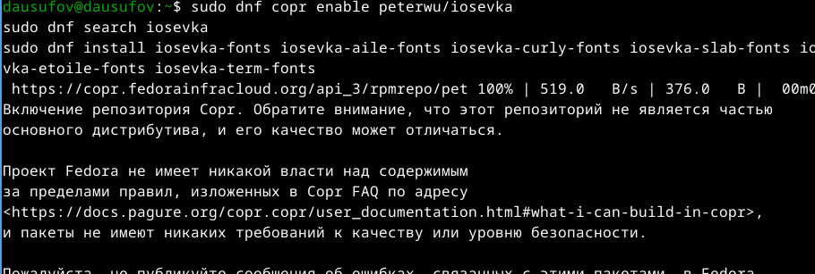

---
## Front matter
lang: ru-RU
title: Лабораторная работа №5
subtitle: Операционные системы
author:
  - Юсуфов Джабар Артикович
institute:
  - Российский университет дружбы народов, Москва, Россия
date: 15 марта 2025

## i18n babel
babel-lang: russian
babel-otherlangs: english

## Formatting pdf
toc: false
toc-title: Содержание
slide_level: 2
aspectratio: 169
section-titles: true
theme: metropolis
header-includes:
 - \metroset{progressbar=frametitle,sectionpage=progressbar,numbering=fraction}
---

## Цель работы

1. Установить дополнительное ПО
2. Установить и настроить pass
3. Настроить интерфейс с браузером
4. Установить и настроить chezmoi

## Настройка

Создал новый ключ (рис.1)

{#fig:001 width=70%}

## Установка менеджера паролей

Устанавливаю pass (рис.2)

{#fig:002 width=70%}

## Установка менеджера паролей

Устанавливаю gopass (рис.3)

{#fig:003 width=70%}

## Установка менеджера паролей

Инициализирую хранилище (рис.4)

{#fig:004 width=70%}

## Установка менеджера паролей

Создаю структуру git (рис.5)

{#fig:005 width=70%}

## Установка менеджера паролей

Задаю адрес репозитория на хостинге (рис.6)

{#fig:006 width=70%}

## Настройка интерфейса с броузером

Устаналиваю программу, обеспечивающая интерфейс native messaging (рис.7)

{#fig:007 width=70%}

## Настройка интерфейса с броузером

Также установка программы (рис.8)

{#fig:008 width=70%}

## Сохранение пароля

Добавляю новый пароль (рис.9)

{#fig:009 width=70%}

## Сохранение пароля

Отображаю пароль для указанного имени файла (рис.10)

{#fig:010 width=70%}

## Дополнительное программное обеспечение

Устанавливаю дополнительное программное обеспечение (рис.11)

{#fig:011 width=70%}

## Дополнительное программное обеспечение

Устанавливаю шрифты (рис.12)

{#fig:012 width=70%}

## Дополнительное программное обеспечение

Устанавливаю бинарынй файл (рис.13)

{#fig:013 width=70%}

## Создание собственного репозитория с помощью утилит

Создаю новый репозиторий (рис.14)

{#fig:014 width=70%}

## Подключение репозитория к своей системе

Инициализирую chezmoi с моим репозиторием dotfiles (рис.15)

{#fig:015 width=70%}

## Подключение репозитория к своей системе

После проверки изменений в домашнем каталоге запускаю команду (рис.16)

{#fig:016 width=70%}

## Выводы

Познакомился с pass, gopass, native messaging, chezmoi. Научился пользоваться этими утилитами, синхронизировать их с git.

