---
## Front matter
lang: ru-RU
title: Презентация по лабораторной работе №6
subtitle: Операционные системы
author:
  - Юсуфов Джабар Артикович
institute:
  - Российский университет дружбы народов, Москва, Россия
date: 22 марта 2025

## i18n babel
babel-lang: russian
babel-otherlangs: english

## Formatting pdf
toc: false
toc-title: Содержание
slide_level: 2
aspectratio: 169
section-titles: true
theme: metropolis
header-includes:
 - \metroset{progressbar=frametitle,sectionpage=progressbar,numbering=fraction}
---

## Цель работы 

Приобретение практических навыков взаимодействия пользователя с системой посредством командной строки.

## Задание 

1. Определение имени домашнего каталога
2. Работа с каталогом /tmp.
3. Создание и удаление каталогов.
4. Определение опции для просмотра содержимого каталогов и подкаталогов.
5. Определение опции, которая позволяет сортировать список по времени последних изменений.
6. Использование команды man.
7. Модификация и исполнение команд.

## Определение имени домашнего каталога

Определил имя домашнего каталога (рис.1).

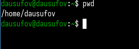{#fig:001 width=70%}

## Работа с каталогом /tmp.

Перешел в каталог /tmp (рис. 2).

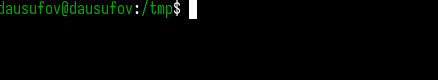{#fig:002 width=70%}

## Работа с каталогом /tmp.

Вывел содержимое каталога /tmp (рис. 3).

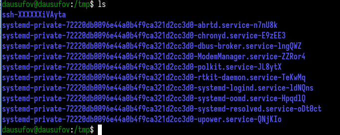{#fig:003 width=70%}

## Работа с каталогом /tmp.

Вывожу подробную информацию о файлах и каталогах (рис. 4).

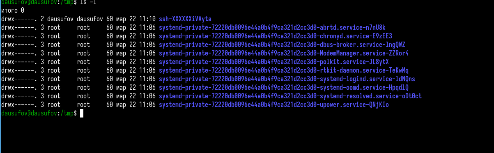{#fig:004 width=70%}

## Работа с каталогом /tmp.

Показываю все файлы, включая скрытые (рис.5).

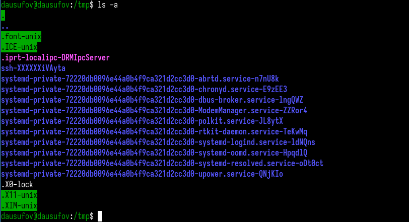{#fig:005 width=70%}

## Работа с каталогом /tmp.

Определяю, есть ли в каталоге /var/spool подкаталог с именем cron (рис.6).

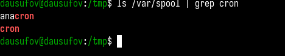{#fig:006 width=70%}

## Работа с каталогом /tmp.

Перехожу в домашний каталог и вывожу его содержимое. Я являюсь владельцем всех файлов (рис.7).

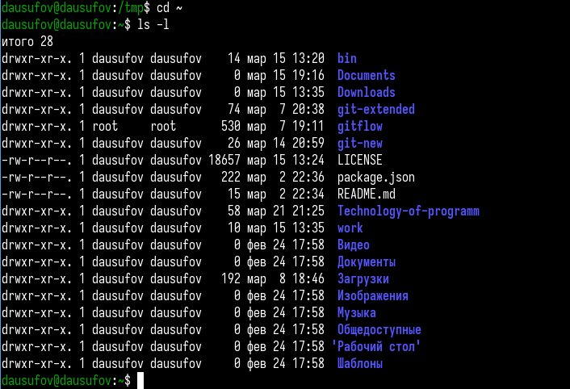{#fig:007 width=70%}

## Создание и удаление каталогов.

Создаю новй каталог с именем newdir и в нем же подкаталог (рис.8).

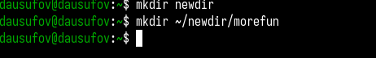{#fig:008 width=70%}

## Создание и удаление каталогов.

Создание одной командой трех новых каталогов и их удаление(рис.9).

{#fig:009 width=70%}

## Создание и удаление каталогов.

Пробую удалить каталог и понимаю, что не удается. Делаю это через другую команду (рис.10).

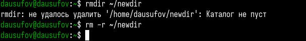{#fig:010 width=70%}

## Определение опции для просмотра содержимого каталогов и подкаталогов.

Определил опцию для просмотра каталога и его подкаталогов (рис.11).

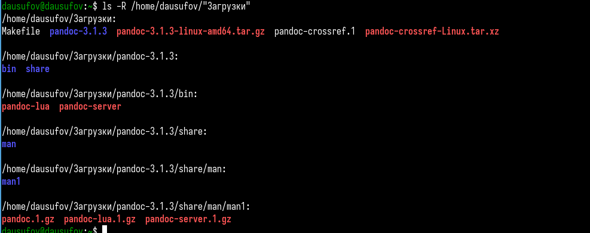{#fig:011 width=70%}

## Определение опции, которая позволяет сортировать список по времени последних изменений.

Определил опции, которая позволяет сортировать список по времени последних изменений  (рис.12).

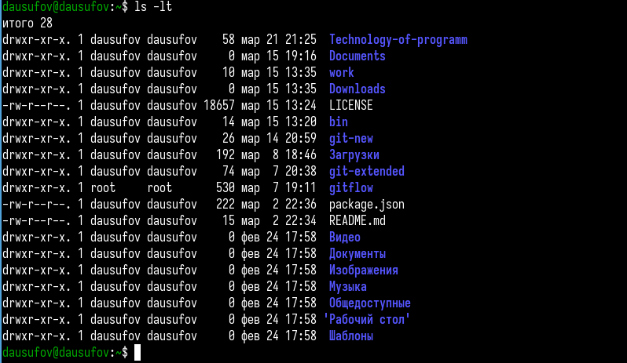{#fig:012 width=70%}

## Использование команды man.

Просматриваю описание команды cd (рис. 13).

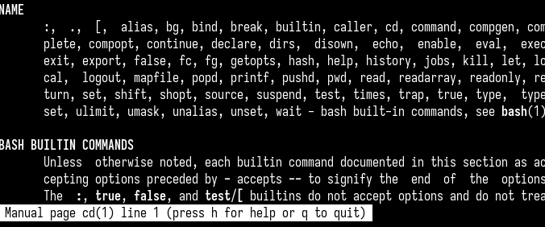{#fig:013 width=70%}

## Использование команды man.

Просматриваю описание команды pwd (рис.14).

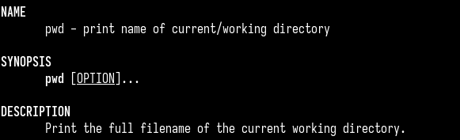{#fig:014 width=70%}

## Использование команды man.

Просматриваю описание команды mkdir (рис.15).

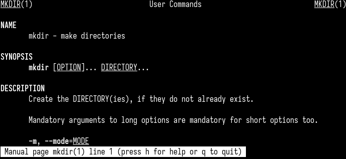{#fig:015 width=70%}

## Использование команды man.

Просматриваю описание команды rmdir (рис.16).

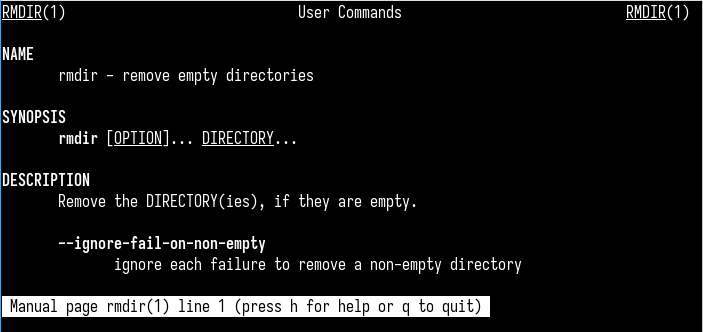{#fig:016 width=70%}

## Использование команды man.

Просматриваю описание команды rm (рис.17).

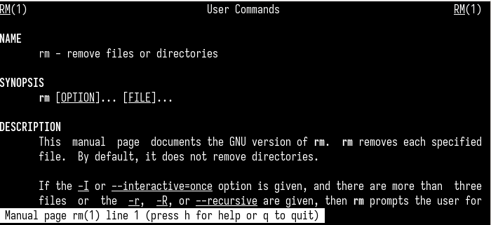{#fig:017 width=70%}

## Модификация и исполнение команд.

Просматриваю историю команд (рис.18).

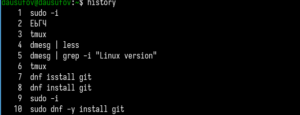{#fig:018 width=70%}

## Модификация и исполнение команд.

Исполняю команду из буфера команд (рис.19).

{#fig:019 width=70%}

## Модификация и исполнение команд.

Модифицирую команду (рис.20).

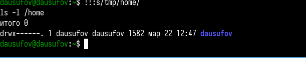{#fig:020 width=70%}

## Выводы

В ходе данной работы я приобрел практические навыки взаимодействия пользователя с системой посредством командной строки.

