---
## Front matter
title: "Отчёт по лабораторной работе №6"
subtitle: "Операционные системы"
author: "Юсуфов Джабар Артикович"

## Generic otions
lang: ru-RU
toc-title: "Содержание"

## Bibliography
bibliography: bib/cite.bib
csl: pandoc/csl/gost-r-7-0-5-2008-numeric.csl

## Pdf output format
toc: true # Table of contents
toc-depth: 2
lof: true # List of figures
lot: true # List of tables
fontsize: 12pt
linestretch: 1.5
papersize: a4
documentclass: scrreprt
## I18n polyglossia
polyglossia-lang:
  name: russian
  options:
	- spelling=modern
	- babelshorthands=true
polyglossia-otherlangs:
  name: english
## I18n babel
babel-lang: russian
babel-otherlangs: english
## Fonts
mainfont: IBM Plex Serif
romanfont: IBM Plex Serif
sansfont: IBM Plex Sans
monofont: IBM Plex Mono
mathfont: STIX Two Math
mainfontoptions: Ligatures=Common,Ligatures=TeX,Scale=0.94
romanfontoptions: Ligatures=Common,Ligatures=TeX,Scale=0.94
sansfontoptions: Ligatures=Common,Ligatures=TeX,Scale=MatchLowercase,Scale=0.94
monofontoptions: Scale=MatchLowercase,Scale=0.94,FakeStretch=0.9
mathfontoptions:
## Biblatex
biblatex: true
biblio-style: "gost-numeric"
biblatexoptions:
  - parentracker=true
  - backend=biber
  - hyperref=auto
  - language=auto
  - autolang=other*
  - citestyle=gost-numeric
## Pandoc-crossref LaTeX customization
figureTitle: "Рис."
tableTitle: "Таблица"
listingTitle: "Листинг"
lofTitle: "Список иллюстраций"
lotTitle: "Список таблиц"
lolTitle: "Листинги"
## Misc options
indent: true
header-includes:
  - \usepackage{indentfirst}
  - \usepackage{float} # keep figures where there are in the text
  - \floatplacement{figure}{H} # keep figures where there are in the text
---

# Цель работы

Приобретение практических навыков взаимодействия пользователя с системой посредством командной строки.

# Задание

1. Определение имени домашнего каталога
2. Работа с каталогом /tmp.
3. Создание и удаление каталогов.
4. Определение опции для просмотра содержимого каталогов и подкаталогов.
5. Определение опции, которая позволяет сортировать список по времени последних изменений.
6. Использование команды man.
7. Модификация и исполнение команд.

# Выполнение лабораторной работы

## Определение имени домашнего каталога

Определил имя домашнего каталога (рис.1).

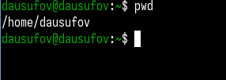{#fig:001 width=70%}

## Работа с каталогом /tmp.

Перешел в каталог /tmp (рис. 2).

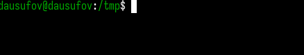{#fig:002 width=70%}

Вывел содержимое каталога /tmp (рис. 3).

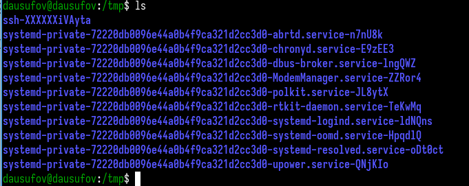{#fig:003 width=70%}

Вывожу подробную информацию о файлах и каталогах (рис. 4).

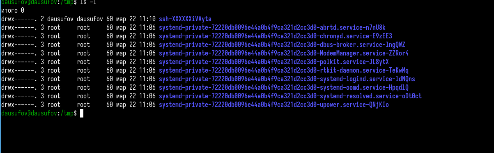{#fig:004 width=70%}

Показываю все файлы, включая скрытые (рис.5).

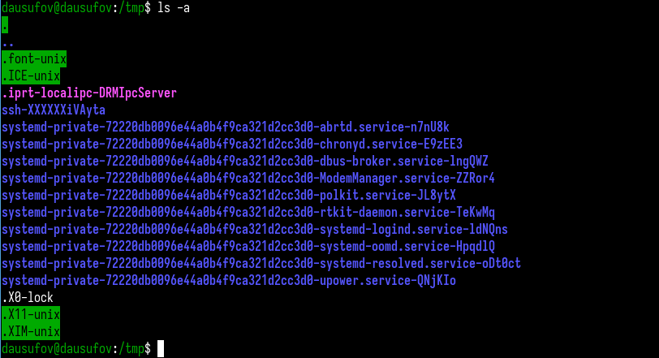{#fig:005 width=70%}

Определяю, есть ли в каталоге /var/spool подкаталог с именем cron (рис.6).

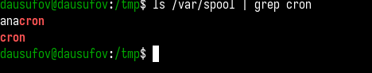{#fig:006 width=70%}

Перехожу в домашний каталог и вывожу его содержимое. Я являюсь владельцем всех файлов (рис.7).

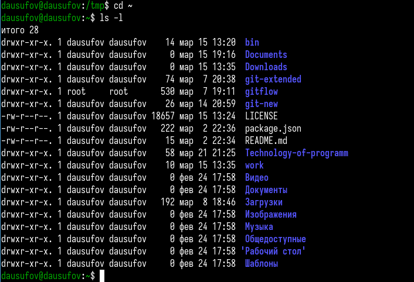{#fig:007 width=70%}

## Создание и удаление каталогов.

Создаю новй каталог с именем newdir и в нем же подкаталог (рис.8).

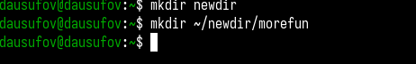{#fig:008 width=70%}

Создание одной командой трех новых каталогов и их удаление(рис.9).

{#fig:009 width=70%}

Пробую удалить каталог и понимаю, что не удается. Делаю это через другую команду (рис.10).

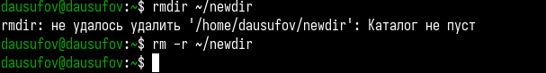{#fig:010 width=70%}

## Определение опции для просмотра содержимого каталогов и подкаталогов.

Определил опцию для просмотра каталога и его подкаталогов (рис.11).

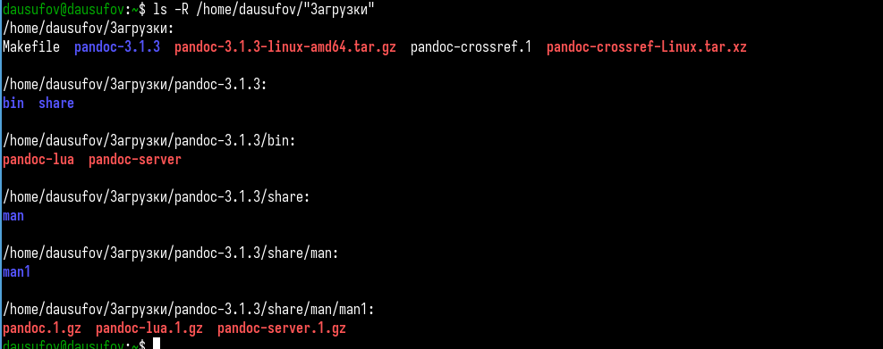{#fig:011 width=70%}

## Определение опции, которая позволяет сортировать список по времени последних изменений.

Определил опции, которая позволяет сортировать список по времени последних изменений  (рис.12).

{#fig:012 width=70%}

## Использование команды man.

Просматриваю описание команды cd (рис. 13).

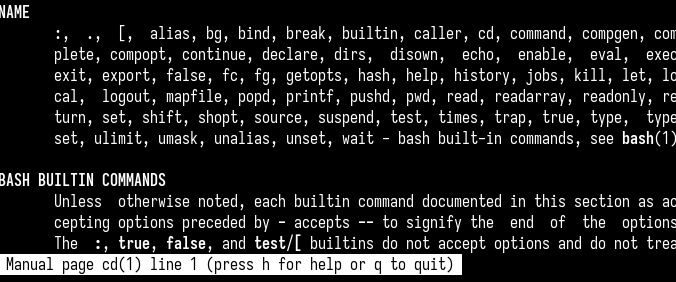{#fig:013 width=70%}

Просматриваю описание команды pwd (рис.14).

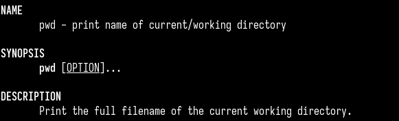{#fig:014 width=70%}

Просматриваю описание команды mkdir (рис.15).

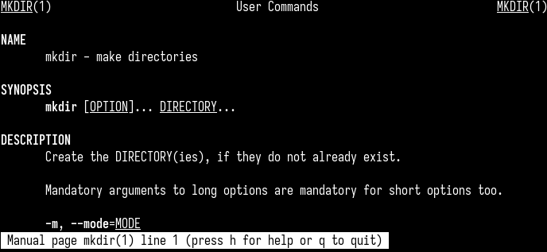{#fig:015 width=70%}

Просматриваю описание команды rmdir (рис.16).

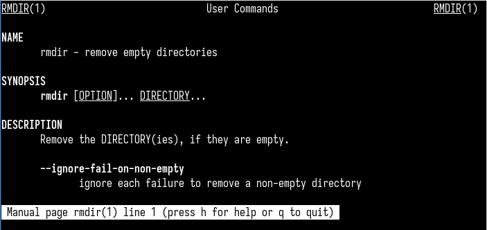{#fig:016 width=70%}

Просматриваю описание команды rm (рис.17).

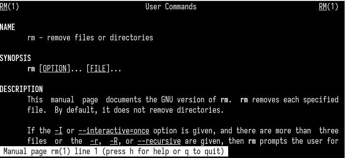{#fig:017 width=70%}

## Модификация и исполнение команд.

Просматриваю историю команд (рис.18).

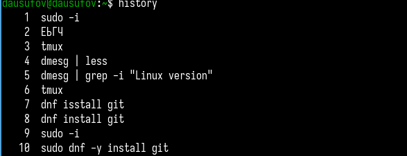{#fig:018 width=70%}

Исполняю команду из буфера команд (рис.19).

{#fig:019 width=70%}

Модифицирую команду (рис.20).

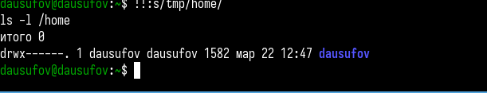{#fig:020 width=70%}

# Выводы

В ходе данной работы я приобрел практические навыки взаимодействия пользователя с системой посредством командной строки.