---
## Front matter
lang: ru-RU
title: Лабораторная работа №7
subtitle: Операционные системы
author:
  - Юсуфов Джабар Артикович
institute:
  - Российский университет дружбы народов, Москва, Россия
date: 29 марта 2025

## i18n babel
babel-lang: russian
babel-otherlangs: english

## Formatting pdf
toc: false
toc-title: Содержание
slide_level: 2
aspectratio: 169
section-titles: true
theme: metropolis
header-includes:
 - \metroset{progressbar=frametitle,sectionpage=progressbar,numbering=fraction}
---

## Цель работы 

Ознакомление с файловой системой Linux, её структурой, именами и содержанием
каталогов. Приобретение практических навыков по применению команд для работы
с файлами и каталогами, по управлению процессами (и работами), по проверке исполь-
зования диска и обслуживанию файловой системы

## Задание

1. Работа с каталогами.
2. Работа с командрй chmod.
3. Работа с каталогами.
4. Работа с man.

## Работа с каталогами

Скопировал файл и назвал его(рис. 1).

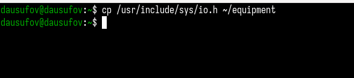{#fig:001 width=70%}

## Работа с каталогами

Создал директорию и переместил туда файл(рис. 2).

{#fig:002 width=70%}

## Работа с каталогами

Переименовал файл(рис. 3).

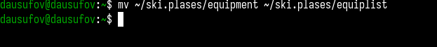{#fig:003 width=70%}

## Работа с каталогами

Создал файл и скопировал его в каталог(рис. 4).

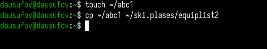{#fig:004 width=70%}

## Работа с каталогами

Создал каталог(рис. 5).

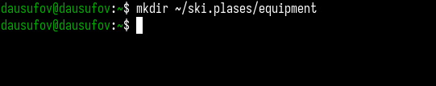{#fig:005 width=70%}

## Работа с каталогами

Переместил файлы в каталог(рис. 6).

{#fig:006 width=70%}

## Работа с каталогами

Создал другой каталог и переместил его(рис. 7).

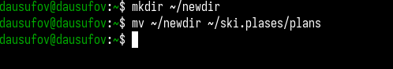{#fig:007 width=70%}

## Работа с командрй chmod.

Создал файл и присвоил ему выделенные права доступа(рис. 8).

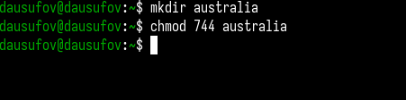{#fig:008 width=70%}

## Работа с командрй chmod.

Создал файл и присвоил ему выделенные права доступа(рис. 9).

{#fig:009 width=70%}

## Работа с командрй chmod.

Создал файл и присвоил ему выделенные права доступа(рис. 10).

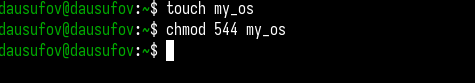{#fig:010 width=70%}

## Работа с командрй chmod.

Создал файл и присвоил ему выделенные права доступа(рис. 11).

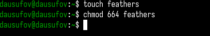{#fig:011 width=70%}

## Работа с каталогами

Просмотрел содержимое файла(рис. 12).

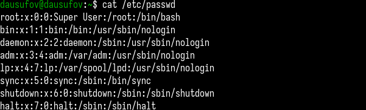{#fig:012 width=70%}

## Работа с каталогами

Скопировал файл в другой(рис. 13).

{#fig:013 width=70%}

## Работа с каталогами

Переместил файл(рис. 14).

{#fig:014 width=70%}

## Работа с каталогами

Скопировал каталог(рис. 15).

{#fig:015 width=70%}

## Работа с каталогами

Переместил каталог и назвал его(рис. 16).

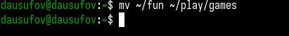{#fig:016 width=70%}

## Работа с каталогами

Лишаю права на чтение владельца файла (рис. 17).

{#fig:017 width=70%}

## Работа с каталогами

При попытке просмотреть файл мне отказывают в доступе(рис. 18).

{#fig:018 width=70%}

## Работа с каталогами

При попытке скопировать файл мне отказывают в доступе((рис. 19).

{#fig:019 width=70%}

## Работа с каталогами

Даю владельцу файла право на чтение(рис. 20).

{#fig:020 width=70%}

## Работа с каталогами

Лишаю владельца каталога прав на выполнение(рис. 21).

{#fig:021 width=70%}

## Работа с каталогами

При попытке перехода в каталог мне отказывают в доступе(рис. 22).

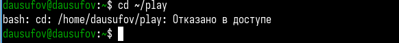{#fig:022 width=70%}

## Работа с каталогами

Возращаю права на выполнение(рис. 23).

{#fig:023 width=70%}

## Работа с man

Монтирую файловую систему(рис. 24).

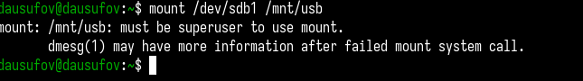{#fig:024 width=70%}

## Работа с man

Проверяю и восстанавливаю файловую систему(рис. 25).

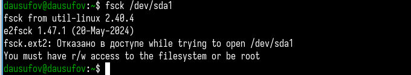{#fig:025 width=70%}

## Работа с man

Создание файловой системы(рис. 26).

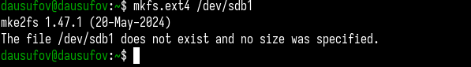{#fig:026 width=70%}

## Работа с man

Отправка сигналов процессам(рис. 27).

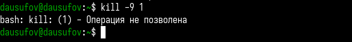{#fig:027 width=70%}

## Выводы

В ходе работы я ознакомился с файловой системой Linux, её структурой, именами и содержанием
каталогов. Приобрел практические навыки по применению команд для работы
с файлами и каталогами, по управлению процессами (и работами), по проверке исполь-
зования диска и обслуживанию файловой системы

