---
## Front matter
title: "Лабораторная работа №7"
subtitle: "Операционные системы"
author: "Юсуфов Джабар Артикович"

## Generic otions
lang: ru-RU
toc-title: "Содержание"

## Bibliography
bibliography: bib/cite.bib
csl: pandoc/csl/gost-r-7-0-5-2008-numeric.csl

## Pdf output format
toc: true # Table of contents
toc-depth: 2
lof: true # List of figures
lot: true # List of tables
fontsize: 12pt
linestretch: 1.5
papersize: a4
documentclass: scrreprt
## I18n polyglossia
polyglossia-lang:
  name: russian
  options:
	- spelling=modern
	- babelshorthands=true
polyglossia-otherlangs:
  name: english
## I18n babel
babel-lang: russian
babel-otherlangs: english
## Fonts
mainfont: IBM Plex Serif
romanfont: IBM Plex Serif
sansfont: IBM Plex Sans
monofont: IBM Plex Mono
mathfont: STIX Two Math
mainfontoptions: Ligatures=Common,Ligatures=TeX,Scale=0.94
romanfontoptions: Ligatures=Common,Ligatures=TeX,Scale=0.94
sansfontoptions: Ligatures=Common,Ligatures=TeX,Scale=MatchLowercase,Scale=0.94
monofontoptions: Scale=MatchLowercase,Scale=0.94,FakeStretch=0.9
mathfontoptions:
## Biblatex
biblatex: true
biblio-style: "gost-numeric"
biblatexoptions:
  - parentracker=true
  - backend=biber
  - hyperref=auto
  - language=auto
  - autolang=other*
  - citestyle=gost-numeric
## Pandoc-crossref LaTeX customization
figureTitle: "Рис."
tableTitle: "Таблица"
listingTitle: "Листинг"
lofTitle: "Список иллюстраций"
lotTitle: "Список таблиц"
lolTitle: "Листинги"
## Misc options
indent: true
header-includes:
  - \usepackage{indentfirst}
  - \usepackage{float} # keep figures where there are in the text
  - \floatplacement{figure}{H} # keep figures where there are in the text
---

# Цель работы

Ознакомление с файловой системой Linux, её структурой, именами и содержанием
каталогов. Приобретение практических навыков по применению команд для работы
с файлами и каталогами, по управлению процессами (и работами), по проверке исполь-
зования диска и обслуживанию файловой системы

# Задание

1. Работа с каталогами.
2. Работа с командрй chmod.
3. Работа с каталогами.
4. Работа с man.

# Выполнение лабораторной работы

## Работа с каталогами

Скопировал файл и назвал его(рис. [-@fig:001]).

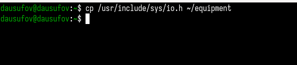{#fig:001 width=70%}

Создал директорию и переместил туда файл(рис. [-@fig:002]).

{#fig:002 width=70%}

Переименовал файл(рис. [-@fig:003]).

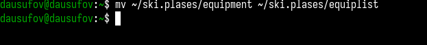{#fig:003 width=70%}

Создал файл и скопировал его в каталог(рис. [-@fig:004]).

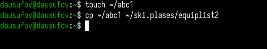{#fig:004 width=70%}

Создал каталог(рис. [-@fig:005]).

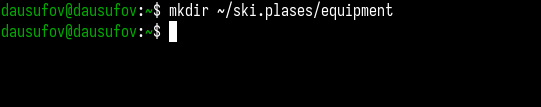{#fig:005 width=70%}

Переместил файлы в каталог(рис. [-@fig:006]).

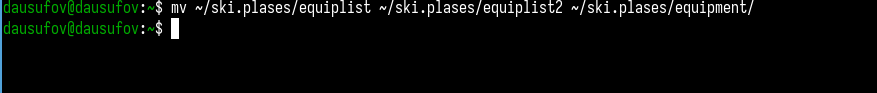{#fig:006 width=70%}

Создал другой каталог и переместил его(рис. [-@fig:007]).

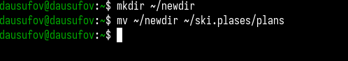{#fig:007 width=70%}

## Работа с командрй chmod.

Создал файл и присвоил ему выделенные права доступа(рис. [-@fig:008]).

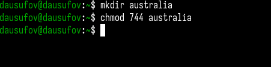{#fig:008 width=70%}

Создал файл и присвоил ему выделенные права доступа(рис. [-@fig:009]).

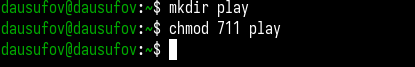{#fig:009 width=70%}

Создал файл и присвоил ему выделенные права доступа(рис. [-@fig:010]).

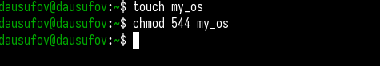{#fig:010 width=70%}

Создал файл и присвоил ему выделенные права доступа(рис. [-@fig:011]).

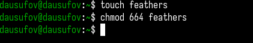{#fig:011 width=70%}

## Работа с каталогами

Просмотрел содержимое файла(рис. [-@fig:012]).

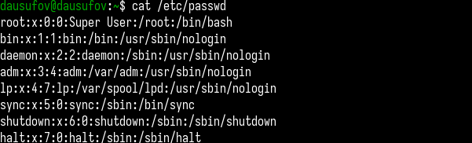{#fig:012 width=70%}

Скопировал файл в другой(рис. [-@fig:013]).

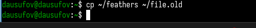{#fig:013 width=70%}

Переместил файл(рис. [-@fig:014]).

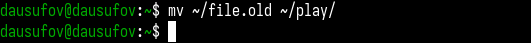{#fig:014 width=70%}

Скопировал каталог(рис. [-@fig:015]).

{#fig:015 width=70%}

Переместил каталог и назвал его(рис. [-@fig:016]).

{#fig:016 width=70%}

Лишаю права на чтение владельца файла (рис. [-@fig:017]).

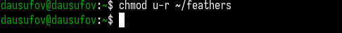{#fig:017 width=70%}

При попытке просмотреть файл мне отказывают в доступе(рис. [-@fig:018]).

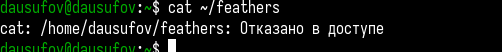{#fig:018 width=70%}

При попытке скопировать файл мне отказывают в доступе((рис. [-@fig:019]).

{#fig:019 width=70%}

Даю владельцу файла право на чтение(рис. [-@fig:020]).

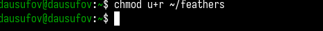{#fig:020 width=70%}

Лишаю владельца каталога прав на выполнение(рис. [-@fig:021]).

{#fig:021 width=70%}

При попытке перехода в каталог мне отказывают в доступе(рис. [-@fig:022]).

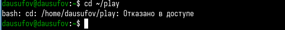{#fig:022 width=70%}

Возращаю права на выполнение(рис. [-@fig:023]).

{#fig:023 width=70%}

Монтирую файловую систему(рис. [-@fig:024]).

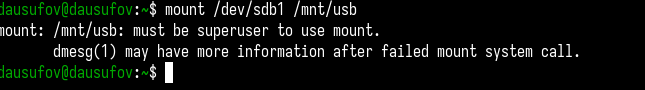{#fig:024 width=70%}

Проверяю и восстанавливаю файловую систему(рис. [-@fig:025]).

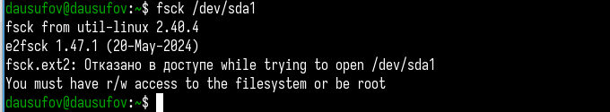{#fig:025 width=70%}

Создание файловой системы(рис. [-@fig:026]).

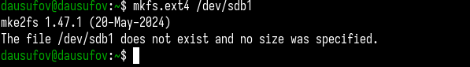{#fig:026 width=70%}

Отправка сигналов процессам(рис. [-@fig:027]).

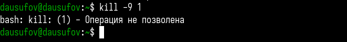{#fig:027 width=70%}

# Выводы

В ходе работы я ознакомился с файловой системой Linux, её структурой, именами и содержанием
каталогов. Приобрел практические навыки по применению команд для работы
с файлами и каталогами, по управлению процессами (и работами), по проверке исполь-
зования диска и обслуживанию файловой системы
