---
## Front matter
lang: ru-RU
title: Лабораторная работа №8
subtitle: Операционные системы
author:
  - Юсуфов Джабар Артикович
institute:
  - Российский университет дружбы народов, Москва, Россия
date: 05 апреля 2025

## i18n babel
babel-lang: russian
babel-otherlangs: english

## Formatting pdf
toc: false
toc-title: Содержание
slide_level: 2
aspectratio: 169
section-titles: true
theme: metropolis
header-includes:
 - \metroset{progressbar=frametitle,sectionpage=progressbar,numbering=fraction}
---

## Цель работы 

Ознакомление с инструментами поиска файлов и фильтрации текстовых данных. Приобретение практических навыков: по управлению процессами (и заданиям), по проверке использования диска и обслуживанию файловых систем.

## Задание

1. Вход в систему
2. Работа с файлами и каталогами
3. Запуск редактора gedit
4. Выполнение команд df и du
5. Вывод имен всех директорий 

## Вход в систему

Вошел в систему под своим именем (рис.1).

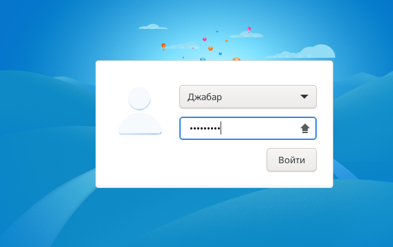{#fig:001 width=50%}

## Работа с файлами и каталогами

Записал названия файлов, содержащихся в /etc (риc.2).

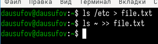{#fig:002 width=40%}

## Работа с файлами и каталогами

Вывел все файлы с расширением .conf (рис.3).

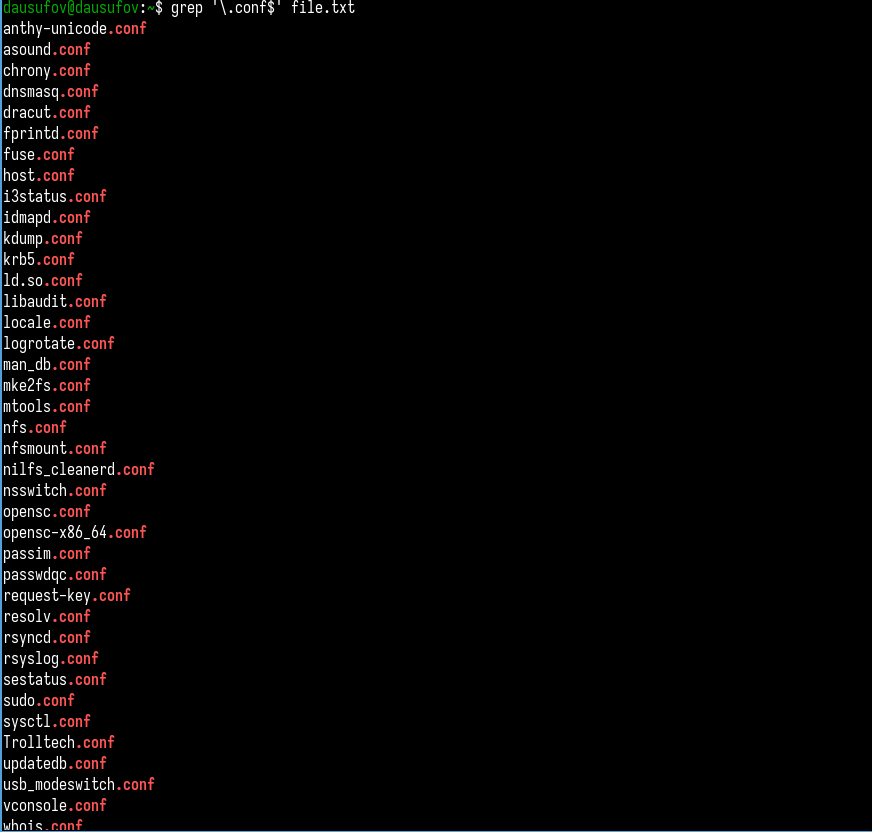{#fig:003 width=25%}

## Работа с файлами и каталогами

Записал файлы выше в файл conf.txt (рис.4).

{#fig:004 width=70%}

## Работа с файлами и каталогами

Определяю, какие файлы начинаются с символа с (рис.5).

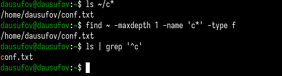{#fig:005 width=70%}

## Работа с файлами и каталогами

Вывел имена файлов, начинающиеся на h (рис.6).

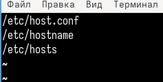{#fig:006 width=70%}

## Работа с файлами и каталогами

Запустил процесс, который будет записывать нужные файлы в другой(рис.7).

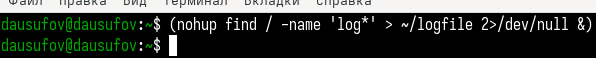{#fig:007 width=70%}

## Работа с файлами и каталогами

Удалил файл ~/logfile (рис.8).

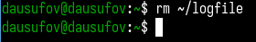{#fig:008 width=70%}

## Запуск редактора gedit

Запустил редактор gedit (рис.9).

{#fig:009 width=70%}

Определил идентификатор gedit (рис.10).

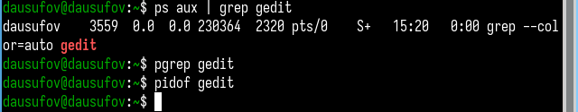{#fig:010 width=70%}

## Выполнение команд df и du.

Получил информацию о команде df (рис.11).

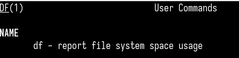{#fig:011 width=70%}

## Выполнение команд df и du.

Получил информацию о команде du (рис.12).

{#fig:012 width=70%}

## Выполнение команд df и du.

Выполнил команду df(рис.13).

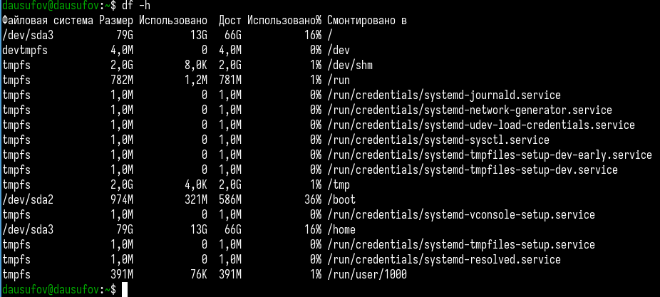{#fig:013 width=70%}

## Выполнение команд df и du.

Выполнил команду du(рис.14).

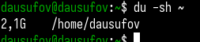{#fig:014 width=70%}

## Вывод имен всех директорий 

Вывел имена всех директорий(рис.15).

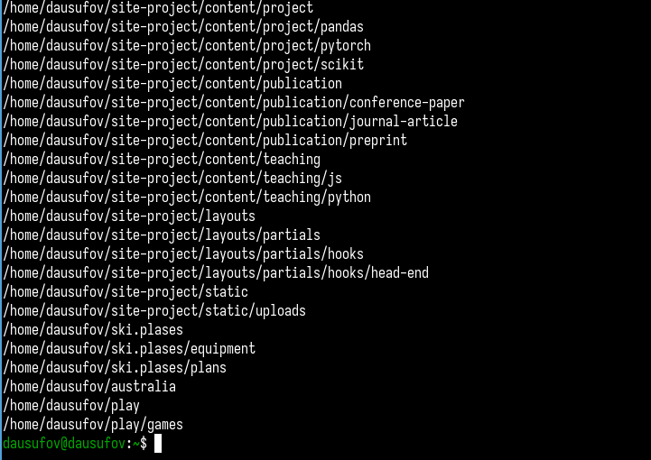{#fig:015 width=50Q%}

## Выводы

В ходе работы я ознакомился с инструментами поиска файлов и фильтрации текстовых данных и приобрел практические навыки: по управлению процессами (и заданиям), по проверке использования диска и обслуживанию файловых систем.

