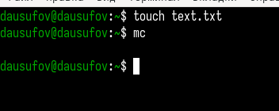
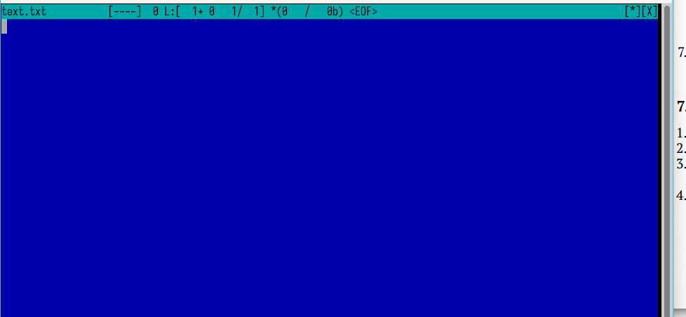
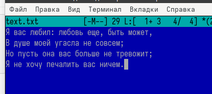
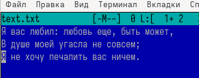
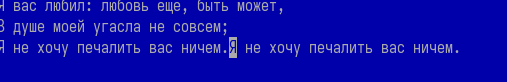
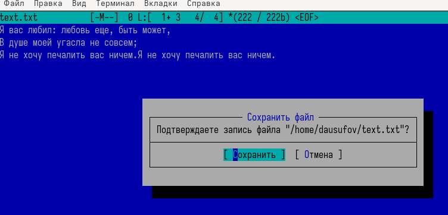
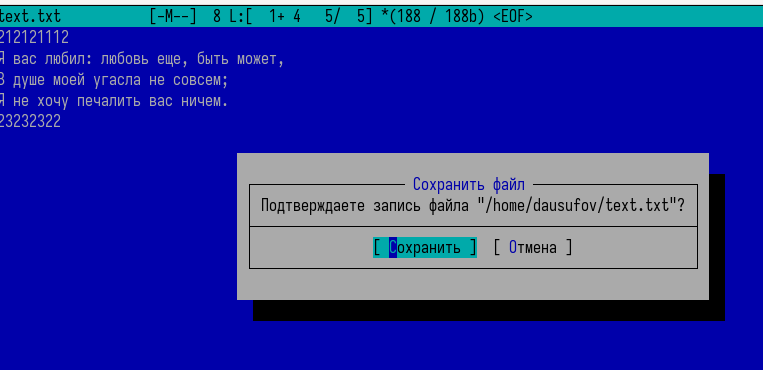
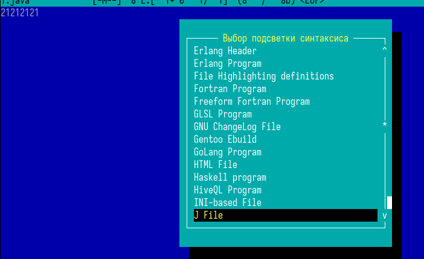

---
## Front matter
lang: ru-RU
title: Лабораторная работа №9
subtitle: Операционные системы
author:
  - Юсуфов Джабар Артикович
institute:
  - Российский университет дружбы народов, Москва, Россия
date: 12 апреля 2025

## i18n babel
babel-lang: russian
babel-otherlangs: english

## Formatting pdf
toc: false
toc-title: Содержание
slide_level: 2
aspectratio: 169
section-titles: true
theme: metropolis
header-includes:
 - \metroset{progressbar=frametitle,sectionpage=progressbar,numbering=fraction}
---

## Цель работы 

Освоение основных возможностей командной оболочки Midnight Commander. Приобретение навыков практической работы по просмотру каталогов и файлов; манипуляций с ними.

## Выполнение лабораторной работы

Создаю файл text.txt и запускаю mc (рис. 1).

{#fig:001 width=70%}

## Выполнение лабораторной работы

Открыл файл с помощью встроенного редактора (рис. 2).

{#fig:002 width=70%}

## Выполнение лабораторной работы

Вставил текст в файл из Интернета (рис. 3).

{#fig:003 width=70%}

## Выполнение лабораторной работы

Удалил строку текста (рис. 4).

{#fig:004 width=70%}

## Выполнение лабораторной работы

Выделил и скопировал строку (рис. 5).

{#fig:005 width=70%}

## Выполнение лабораторной работы

Сохранил файл (рис. 6).

{#fig:006 width=70%}

## Выполнение лабораторной работы

В конце и в начале файла написал некоторый текст (рис. 7).

{#fig:007 width=70%}

## Выполнение лабораторной работы

Включил подсветку текста (рис. 8).

{#fig:008 width=70%}

## Выводы

В ходе данной работы я освоил основные возможности командной оболочки Midnight Commander и приобрел навыки практической работы по просмотру каталогов и файлов; манипуляций с ними.

