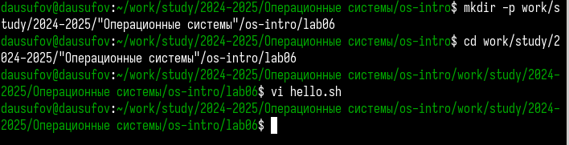
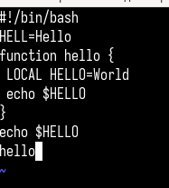
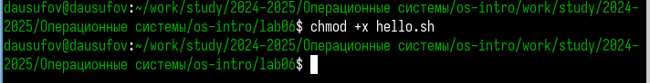
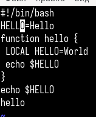
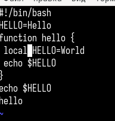
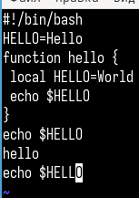
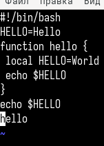
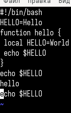

---
## Front matter
lang: ru-RU
title: Лабораторная работа №10
subtitle: Операционные системы
author:
  - Юсуфов Джабар Артикович
institute:
  - Российский университет дружбы народов, Москва, Россия
date: 19 апреля 2025

## i18n babel
babel-lang: russian
babel-otherlangs: english

## Formatting pdf
toc: false
toc-title: Содержание
slide_level: 2
aspectratio: 169
section-titles: true
theme: metropolis
header-includes:
 - \metroset{progressbar=frametitle,sectionpage=progressbar,numbering=fraction}
---

## Цель работы 

Познакомиться с операционной системой Linux. Получить практические навыки работы с редактором vi, установленным по умолчанию практически во всех дистрибутивах.

## Задание

1. Ознакомиться с теоретическим материалом.
2. Ознакомиться с редактором vi.
3. Выполнить упраженения, используя команды vi.

# Выполнение лабораторной работы

## Создание нового файла с использованием vi.

Создал каталог и файл и вызвал vi (рис. 1).

{#fig:001 width=70%}

## Создание нового файла с использованием vi.

Ввел нужный текст в файл (рис. 2).

{#fig:003 width=30%}

## Создание нового файла с использованием vi.

Сделал файл исполняемым (рис. 3).

{#fig:003 width=70%}

## Редактирование существующего файла

Заменил HELL на HELLO (рис. 4).

{#fig:004 width=30%}

## Редактирование существующего файла

Заменил LOCAL на local (рис. 5).

{#fig:005 width=30%}

## Редактирование существующего файла

Вставил новую строку в конец (рис. 6).

{#fig:006 width=30%}

## Редактирование существующего файла

Отменил последнюю команду (рис. 7).

{#fig:007 width=30%}

## Редактирование существующего файла

Записал произведенные изменения (рис. 8).

{#fig:008 width=30%}

# Выводы

В ходе работы я познакомился с операционной системой Linux. Получил практические навыки работы с редактором vi, установленным по умолчанию практически во всех дистрибутивах.

